# Documentación Técnica — EvalAgent SENA 🤖

> **Agente de Sustentación Oral por Voz para Proyectos de Estudiantes (ADSO / SENA)**
> Documentación técnica generada siguiendo la guía de los Módulos 4 y 5 del máster LIDR AI4Devs
> (diagramas como código con Mermaid, modelo de datos, C4, casos de uso, historias de usuario y tickets).

---

## Tabla de contenidos

1. [Ficha del proyecto](#1-ficha-del-proyecto)
2. [Descripción general del producto](#2-descripción-general-del-producto)
3. [Lean Canvas](#3-lean-canvas-modelo-de-negocio)
4. [Casos de uso](#4-casos-de-uso)
5. [Arquitectura del sistema](#5-arquitectura-del-sistema)
6. [Modelo C4](#6-modelo-c4)
7. [Modelo de datos](#7-modelo-de-datos)
8. [Diagramas de flujo y secuencia](#8-diagramas-de-flujo-y-secuencia)
9. [Especificación de la API](#9-especificación-de-la-api)
10. [Stack tecnológico](#10-stack-tecnológico)
11. [Decisiones de diseño (ADRs)](#11-decisiones-de-diseño-adrs)
12. [Historias de usuario](#12-historias-de-usuario)
13. [Tickets de trabajo](#13-tickets-de-trabajo)
14. [Discrepancias detectadas y deuda técnica](#14-discrepancias-detectadas-y-deuda-técnica)
15. [Instalación y despliegue](#15-instalación-y-despliegue)

---

## 1. Ficha del proyecto

| Campo | Valor |
|---|---|
| **Nombre** | EvalAgent SENA |
| **Tipo** | Agente conversacional de evaluación oral por voz |
| **Dominio** | Educación / Evaluación académica (programa ADSO del SENA) |
| **Objetivo** | Automatizar la sustentación oral de proyectos de estudiantes mediante un agente de IA que pregunta por voz, transcribe y califica |
| **Modo de ejecución** | 100 % local (privacidad total, sin enviar datos a la nube) |
| **Backend** | Python 3.10+ · FastAPI · WebSocket |
| **IA/LLM** | Ollama + Llama 3.1 8B (local) |
| **STT** | faster-whisper (modelo `medium`, ES) |
| **TTS** | macOS `say` (voz "Paulina") — *ver [§14](#14-discrepancias-detectadas-y-deuda-técnica)* |
| **Frontend** | HTML + JS vanilla + WebRTC (sin frameworks) |
| **Persistencia** | Ficheros en disco (`.md` para proyectos, `.json` para reportes) |

---

## 2. Descripción general del producto

### 2.1 Problema a resolver

La sustentación oral de proyectos en programas técnicos (como ADSO del SENA) es un cuello de botella: **cada estudiante requiere que un instructor esté presente entre 10 y 20 minutos** para hacer preguntas, evaluar comprensión y detectar si el estudiante realmente entiende su código o solo lo copió. Con decenas o cientos de aprendices, esto es inviable de escalar.

### 2.2 Solución

Un **agente evaluador virtual** que:

- Saluda al estudiante y conduce una conversación por **voz** (habla y escucha).
- Hace **preguntas técnicas adaptadas al tipo de proyecto** (API REST, fundamentos de Python, etc.).
- **Profundiza** cuando una respuesta es vaga y **reconoce** las respuestas buenas.
- Al terminar, **califica automáticamente** cada criterio (0–10) usando el LLM y genera un **reporte JSON** con transcripción completa, puntajes, porcentaje y veredicto (aprobado ≥ 60 %).
- Permite al **docente revisar todos los reportes** desde un panel de administración.

### 2.3 Valor añadido y ventajas competitivas

| Ventaja | Detalle |
|---|---|
| 🔒 **Privacidad total** | Todo corre en local (Ollama, Whisper, `say`). Ningún dato de los estudiantes sale del equipo — clave para cumplimiento GDPR/protección de datos de menores/aprendices. |
| 💸 **Coste cero de inferencia** | No hay APIs de pago (OpenAI, ElevenLabs). Solo el hardware del docente. |
| 🎙️ **Interacción natural por voz** | El estudiante *habla*, no escribe. Simula una sustentación real. |
| 🧠 **Adaptativo al proyecto** | Los criterios y preguntas cambian según el contexto (`proyectos/*.md`). |
| ⚖️ **Evaluación consistente y objetiva** | El mismo evaluador aplica los mismos criterios a todos los estudiantes. |
| 📊 **Reporte auditable** | Transcripción completa + puntajes por criterio, revisable por el docente. |

### 2.4 Características / funcionalidades principales

- **F1** — Selección de proyecto a sustentar (cargado desde `proyectos/*.md`).
- **F2** — Verificación de permiso de micrófono (contexto seguro HTTPS/localhost).
- **F3** — Conversación por voz en tiempo real vía WebSocket (STT ↔ LLM ↔ TTS).
- **F4** — Detección automática del tipo de proyecto (Python vs API) para adaptar criterios.
- **F5** — Calificación automática por rúbrica (0–10 por criterio) al cierre.
- **F6** — Generación y descarga de reporte JSON.
- **F7** — Panel de administración (`/admin`) para el docente.

---

## 3. Lean Canvas (modelo de negocio)

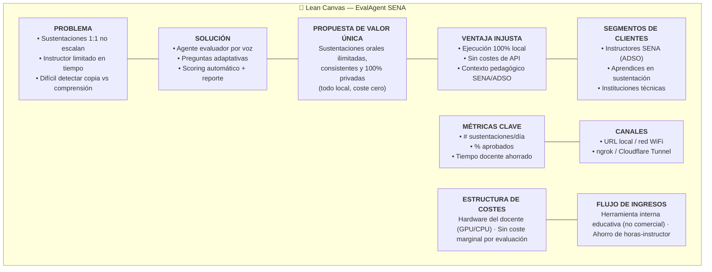

---

## 4. Casos de uso

### 4.1 Diagrama de casos de uso

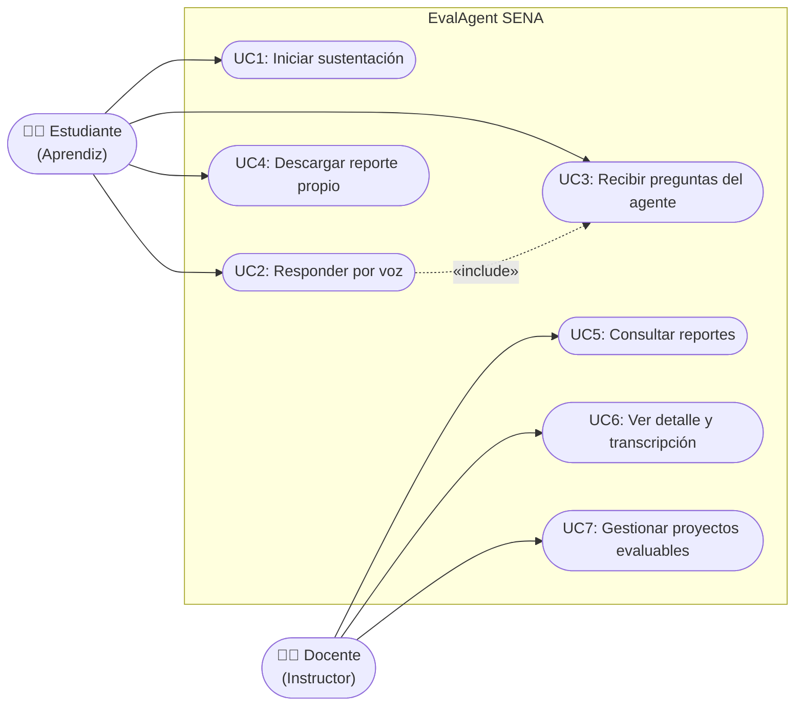

### 4.2 Los 3 casos de uso principales (detallados)

#### UC1 — Iniciar y completar una sustentación

| Campo | Detalle |
|---|---|
| **Actor** | Estudiante |
| **Precondición** | Micrófono autorizado; proyecto disponible en `proyectos/` |
| **Flujo principal** | 1. Ingresa nombre y selecciona proyecto → 2. Concede micrófono → 3. Pulsa "Iniciar" → 4. Se abre WebSocket, el agente saluda por voz → 5. Bucle de preguntas/respuestas hasta `max_questions` (8) → 6. El agente cierra cordialmente → 7. Se genera y muestra el reporte |
| **Postcondición** | Reporte persistido en `reportes/{session_id}.json` |
| **Flujo alterno** | Transcripción vacía → el sistema pide repetir sin consumir pregunta |

#### UC2 — Responder por voz

| Campo | Detalle |
|---|---|
| **Actor** | Estudiante |
| **Flujo** | Pulsa 🎙️ → habla → pulsa ⏹ → el audio (webm/mp4/ogg) se envía en base64 → backend transcodifica a WAV 16 kHz con ffmpeg → Whisper transcribe → se muestra la transcripción → el agente responde |
| **Regla** | Solo se puede grabar cuando el agente NO está hablando (`canRecord`) |

#### UC5 — Consultar y auditar reportes (Docente)

| Campo | Detalle |
|---|---|
| **Actor** | Docente |
| **Flujo** | Abre `/admin` → `GET /api/admin/reports` lista todos los JSON → selecciona uno → `GET /api/admin/reports/{id}` muestra puntajes por criterio y la transcripción completa |
| **Valor** | Auditoría humana del veredicto automático (revisar / corregir la nota) |

---

## 5. Arquitectura del sistema

### 5.1 Descripción a alto nivel

EvalAgent es un **monolito modular** con arquitectura cliente-servidor en tiempo real:

- El **frontend** (SPA de un solo archivo HTML) captura audio con la **Web Audio API / MediaRecorder** y mantiene una conexión **WebSocket** persistente.
- El **backend FastAPI** orquesta un *pipeline de voz* por cada turno: **STT → LLM → TTS**, todo contra servicios locales.
- Cada sesión de sustentación se representa con una instancia de `EvaluatorAgent` guardada **en memoria** (`sessions: dict`), que mantiene el historial de conversación y el estado.
- La **persistencia** es basada en ficheros: los proyectos son Markdown de entrada; los reportes son JSON de salida.

### 5.2 Diagrama de contenedores / componentes

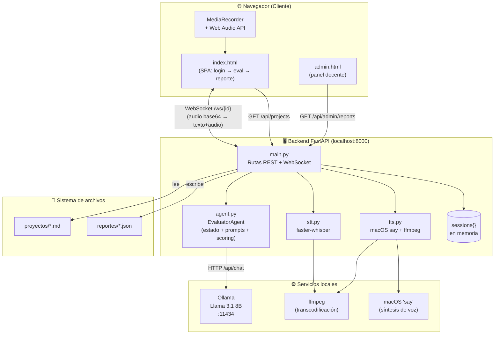

### 5.3 Diagrama de despliegue

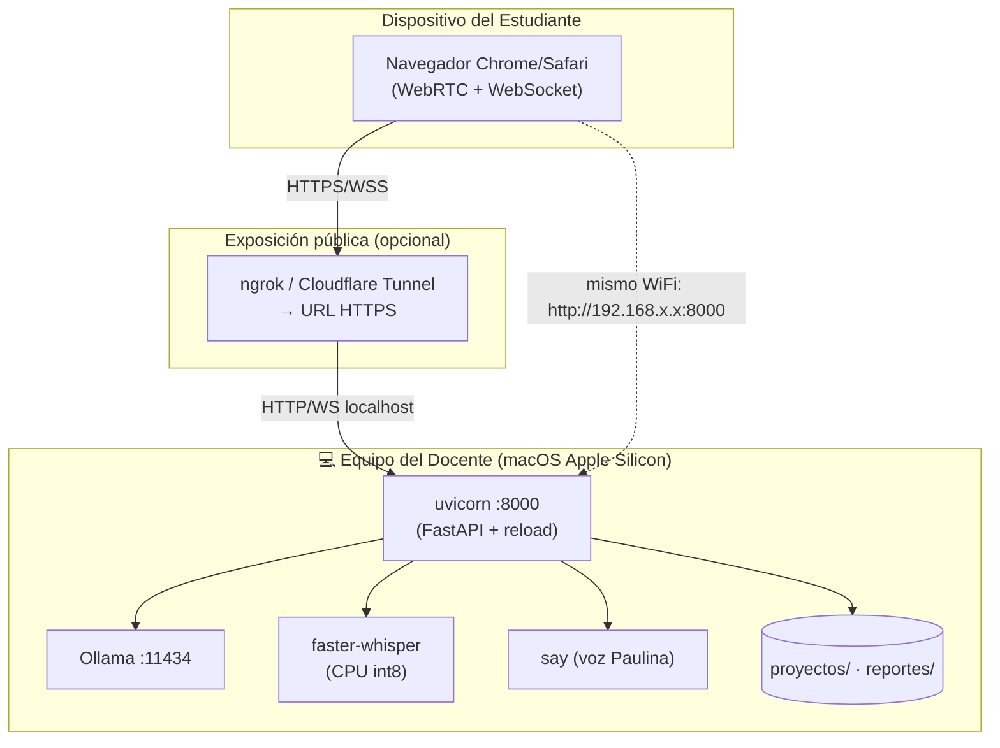

> **Nota de seguridad:** `getUserMedia` (micrófono) solo funciona en **contexto seguro** (localhost o HTTPS). Por eso, para exponer a estudiantes en otro equipo es obligatorio un túnel HTTPS (ngrok/Cloudflare); la IP de red local solo funciona con `http://` desde el mismo navegador que lo permita.

---

## 6. Modelo C4

Siguiendo el modelo C4 de Simon Brown. A continuación se profundiza hasta el nivel de **componentes** del contenedor Backend, y el nivel de **código** del componente `EvaluatorAgent`.

### 6.1 Nivel 1 — Contexto del sistema

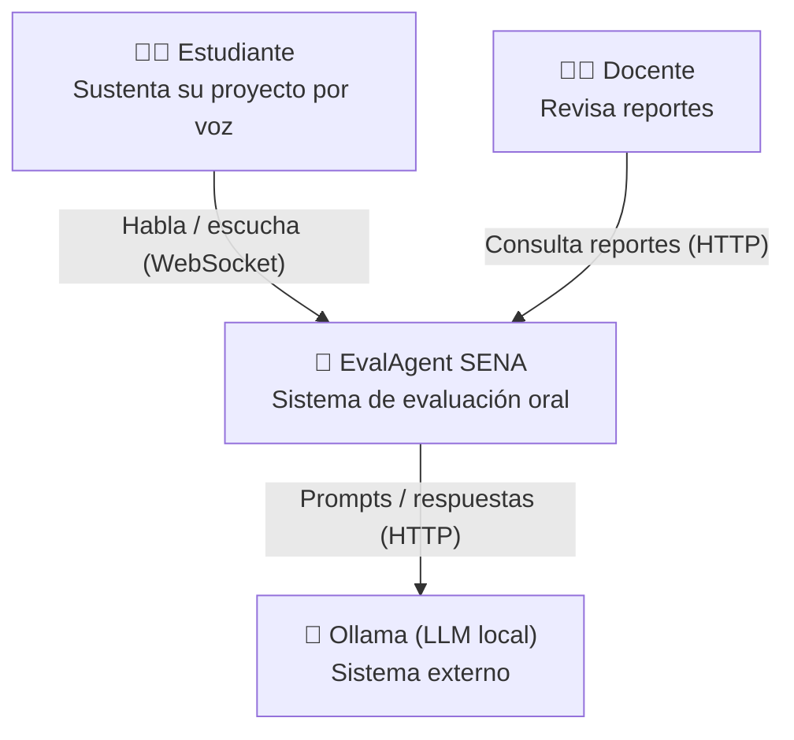

### 6.2 Nivel 2 — Contenedores

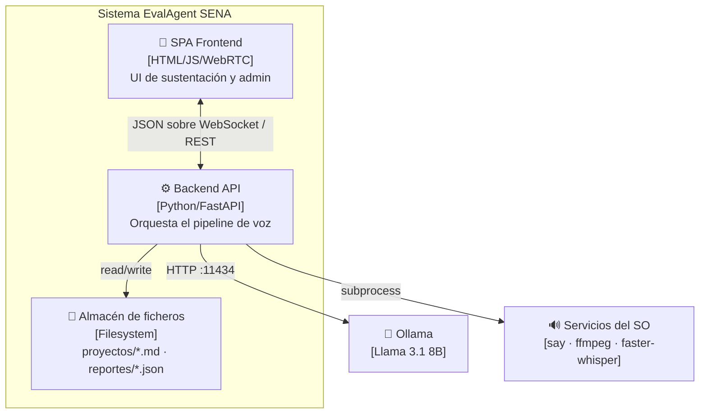

### 6.3 Nivel 3 — Componentes del Backend

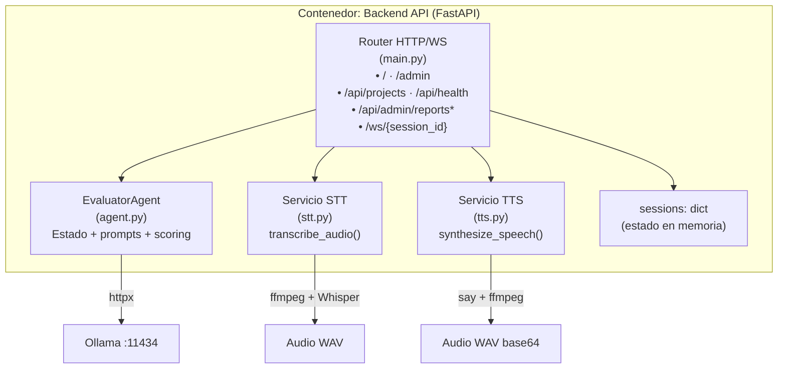

### 6.4 Nivel 4 — Código del componente `EvaluatorAgent`

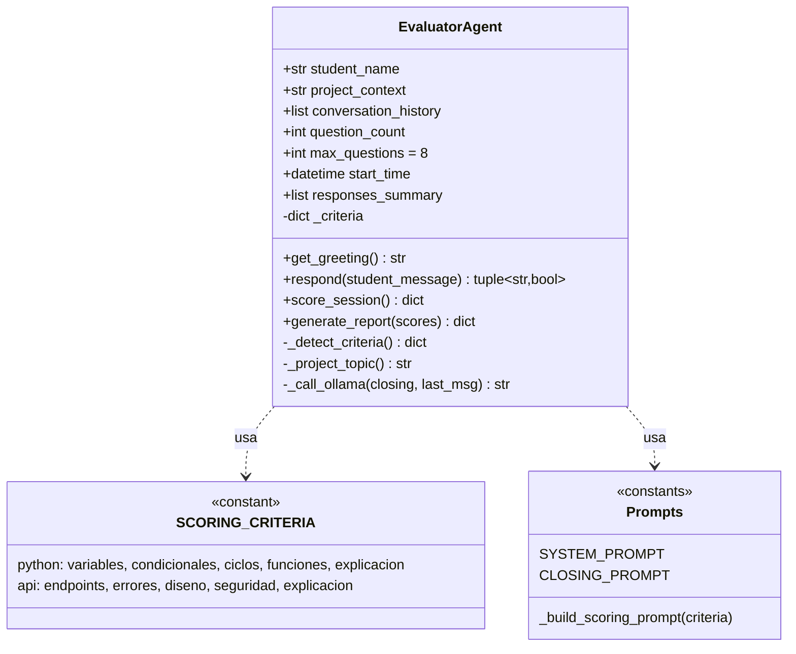

---

## 7. Modelo de datos

El sistema **no usa base de datos relacional**; persiste en ficheros. Aun así, las entidades lógicas y sus relaciones se modelan a continuación.

### 7.1 Diagrama entidad-relación

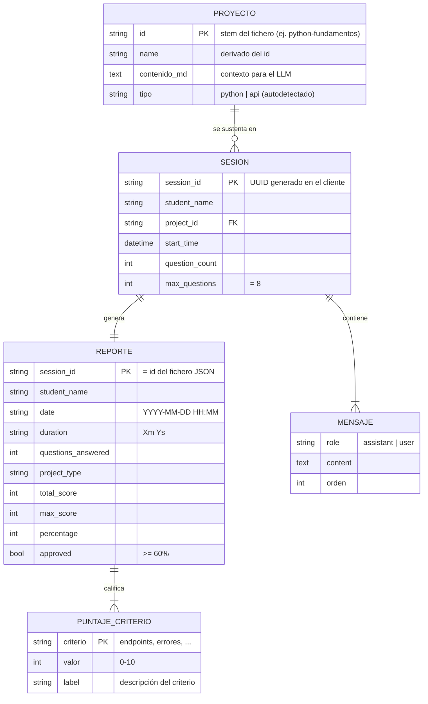

### 7.2 Esquema del reporte JSON (salida real)

```jsonc
{
  "student_name": "test",
  "date": "2026-05-31 21:37",
  "duration": "6m 23s",
  "questions_answered": 8,
  "scores": { "endpoints": 0, "errores": 0, "diseno": 0, "seguridad": 0, "explicacion": 0 },
  "total_score": 0,
  "max_score": 50,
  "percentage": 0,
  "approved": false,
  "conversation": [
    { "role": "assistant", "content": "Hola test, bienvenido..." },
    { "role": "user", "content": "Mi proyecto trata de una API..." }
  ]
}
```

> **Rúbricas soportadas** (autodetectadas en `_detect_criteria`):
> - **`python`** → variables, condicionales, ciclos, funciones, explicación.
> - **`api`** → endpoints, errores, diseño, seguridad, explicación (rúbrica por defecto).
>
> `max_score = nº criterios × 10 = 50`. **Aprobado ≥ 60 %.**

---

## 8. Diagramas de flujo y secuencia

### 8.1 Secuencia — Turno completo de una pregunta (STT → LLM → TTS)

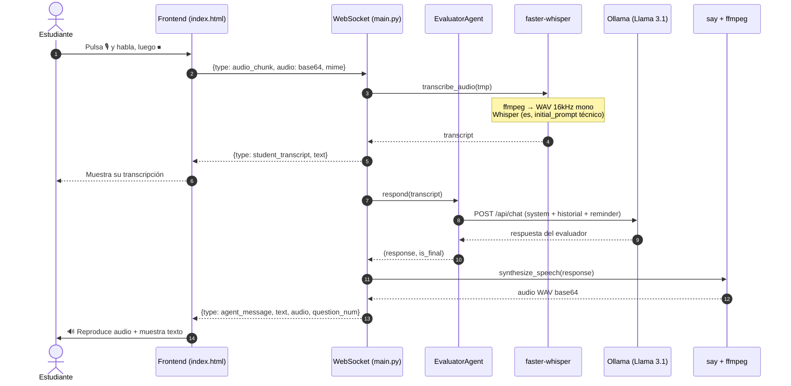

### 8.2 Secuencia — Cierre y generación de reporte

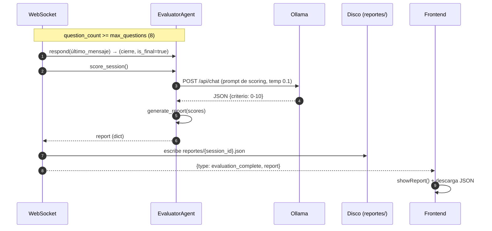

### 8.3 Flujo — Máquina de estados del frontend

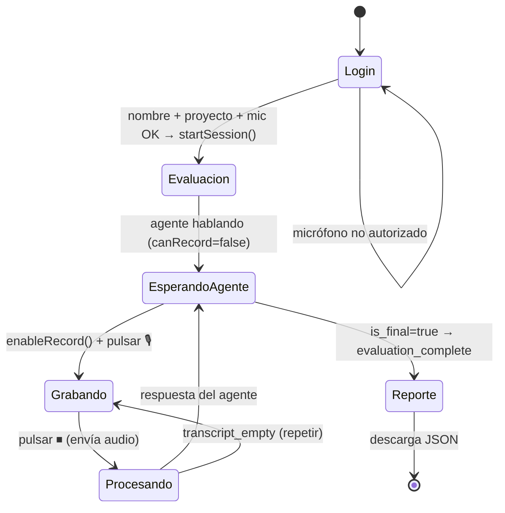

### 8.4 Flujo — Lógica de decisión del agente por turno

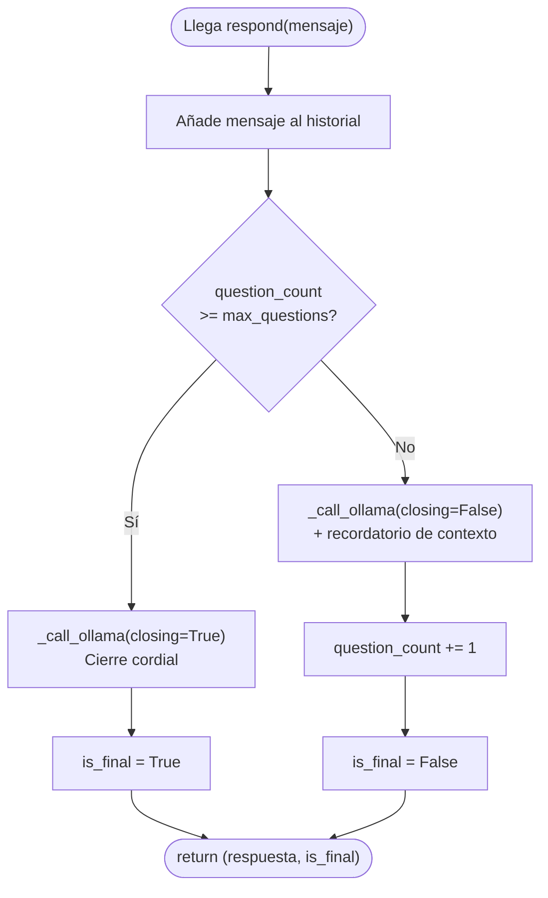

---

## 9. Especificación de la API

### 9.1 Endpoints REST

| Método | Ruta | Descripción | Respuesta |
|---|---|---|---|
| `GET` | `/` | Sirve la SPA del estudiante | `index.html` |
| `GET` | `/admin` | Sirve el panel del docente | `admin.html` |
| `GET` | `/api/projects` | Lista proyectos evaluables (`.md`/`.txt`) | `{ "projects": [{id, name}] }` |
| `GET` | `/api/health` | Healthcheck + nº de sesiones activas | `{ "status": "ok", "sessions": n }` |
| `GET` | `/api/admin/reports` | Lista resumida de todos los reportes | `{ "reports": [...] }` |
| `GET` | `/api/admin/reports/{report_id}` | Reporte completo por ID | JSON del reporte / `404` |

### 9.2 Protocolo WebSocket — `/ws/{session_id}`

**Handshake inicial** (cliente → servidor, primer mensaje):

```json
{ "student_name": "Juan Camilo", "project_id": "gestion-tareas" }
```

**Mensajes cliente → servidor:**

| `type` | Payload | Acción |
|---|---|---|
| `audio_chunk` | `{ audio: base64, mime_type }` | Transcribe y hace avanzar la conversación |
| `ping` | — | Keep-alive → responde `pong` |

**Mensajes servidor → cliente:**

| `type` | Payload | Significado |
|---|---|---|
| `agent_message` | `{ text, audio, question_num, total_questions, is_final }` | Turno del evaluador (con audio TTS) |
| `student_transcript` | `{ text }` | Eco de la transcripción del estudiante |
| `transcript_empty` | — | No se detectó voz; repetir sin gastar pregunta |
| `evaluation_complete` | `{ report }` | Fin de la sustentación + reporte |
| `error` | `{ message }` | Error del servidor |

### 9.3 Integración con Ollama (LLM)

```
POST http://localhost:11434/api/chat
```

- **Conversación:** `temperature 0.4`, `num_predict 200`, `repeat_penalty 1.1`.
- **Scoring:** `temperature 0.1`, `num_predict 120` (más determinista); se extrae el JSON con regex y se acota cada valor a `[0, 10]`.

---

## 10. Stack tecnológico

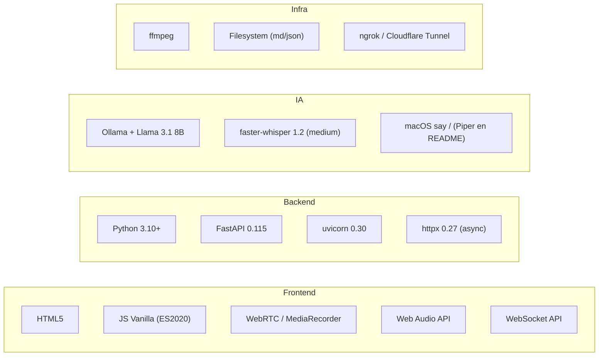

| Capa | Tecnología | Justificación |
|---|---|---|
| Frontend | HTML + JS vanilla | Sin build, sin dependencias, portable |
| Transporte | WebSocket | Conversación bidireccional en tiempo real |
| Backend | FastAPI + uvicorn | Async nativo, WebSocket de primera clase |
| LLM | Llama 3.1 8B vía Ollama | Local, gratis, buen español |
| STT | faster-whisper `medium` | Precisión en términos técnicos ES (int8/CPU) |
| TTS | macOS `say` | Cero instalación en Mac (ver §14) |
| Audio | ffmpeg | Transcodificación a WAV 16 kHz mono |

---

## 11. Decisiones de diseño (ADRs)

> Formato Architecture Decision Record resumido: **Contexto → Decisión → Consecuencias**.

### ADR-01 — Ejecución 100 % local
- **Contexto:** datos sensibles de aprendices; presupuesto nulo.
- **Decisión:** Ollama + Whisper + `say`, sin APIs cloud.
- **Consecuencias:** ✅ privacidad y coste cero · ❌ dependiente del hardware del docente y (hoy) de macOS para el TTS.

### ADR-02 — Estado de sesión en memoria (`sessions: dict`)
- **Decisión:** cada sustentación vive en RAM mientras dura el WebSocket.
- **Consecuencias:** ✅ simple, rápido · ❌ no sobrevive a reinicios ni escala horizontalmente; la persistencia solo ocurre al final (reporte JSON).

### ADR-03 — Persistencia basada en ficheros
- **Decisión:** proyectos en `.md`, reportes en `.json`.
- **Consecuencias:** ✅ legible por humanos, versionable en git, sin BD que administrar · ❌ sin queries, sin concurrencia transaccional.

### ADR-04 — Rúbrica autodetectada por palabras clave
- **Decisión:** `_detect_criteria()` inspecciona el contexto del proyecto para elegir rúbrica `python` o `api`.
- **Consecuencias:** ✅ preguntas y scoring adaptados sin configuración · ❌ heurística frágil (basada en substrings); default siempre `api`.

### ADR-05 — Prompt-engineering defensivo del evaluador
- **Decisión:** `SYSTEM_PROMPT` con reglas absolutas (nunca rechazar, interpretar errores de STT, una pregunta por turno, no dar respuestas).
- **Consecuencias:** ✅ comportamiento consistente y pedagógico · ❌ ligado al modelo; cambiar de LLM puede requerir reajustar el prompt.

---

## 12. Historias de usuario

> Formato estándar + criterios de aceptación en **Gherkin (Given/When/Then)**, evaluados contra **INVEST**.

### HU-01 — Sustentar por voz

> **Como** aprendiz, **quiero** responder las preguntas del evaluador hablando por micrófono, **para** simular una sustentación real sin tener que escribir.

**Criterios de aceptación:**
```gherkin
Dado que autoricé el micrófono y seleccioné mi proyecto
Cuando pulso el botón de grabar, hablo y pulso detener
Entonces el sistema transcribe mi respuesta y me la muestra en pantalla
Y el evaluador responde por voz con la siguiente pregunta
```
- **INVEST:** Independiente ✔ · Valiosa ✔ · Estimable (M) ✔ · Testable ✔.

### HU-02 — Preguntas adaptadas al proyecto

> **Como** aprendiz, **quiero** que las preguntas se ajusten al tipo de mi proyecto (Python básico vs API), **para** ser evaluado sobre lo que realmente construí.

```gherkin
Dado que mi proyecto es de "fundamentos de Python"
Cuando inicio la sustentación
Entonces las preguntas tratan sobre variables, ciclos y funciones
Y NO sobre endpoints HTTP ni bases de datos
```
- **INVEST:** Negociable ✔ · Valiosa ✔ · Small (S/M) ✔.

### HU-03 — Reporte automático al finalizar

> **Como** aprendiz, **quiero** recibir un reporte con mi transcripción y resultado, **para** conocer y descargar la evidencia de mi sustentación.

```gherkin
Dado que respondí las 8 preguntas
Cuando el evaluador cierra la sesión
Entonces se genera un reporte con puntaje por criterio, porcentaje y veredicto
Y puedo descargarlo como archivo JSON
```
- **INVEST:** Valiosa ✔ · Testable ✔ · Estimable (M) ✔.

### HU-04 — Auditoría docente

> **Como** docente, **quiero** revisar todos los reportes con su transcripción y puntajes, **para** validar o corregir la evaluación automática.

```gherkin
Dado que existen reportes en la carpeta reportes/
Cuando abro el panel /admin
Entonces veo la lista de estudiantes con su porcentaje y estado (aprobado/reprobado)
Y al abrir uno veo el desglose por criterio y la conversación completa
```
- **INVEST:** Independiente ✔ · Valiosa ✔ · Testable ✔.

---

## 13. Tickets de trabajo

> Descomposición técnica derivada de las historias de usuario. Estimación en *story points* (escala Fibonacci).

### De HU-01 (Sustentar por voz)

| ID | Título | Descripción | Criterios de aceptación | Est. |
|---|---|---|---|---|
| **T-01** | Captura y envío de audio | Integrar `MediaRecorder` + selección de MIME soportado; enviar base64 por WS | El audio llega al backend en `audio_chunk` con `mime_type` correcto | 3 |
| **T-02** | Pipeline STT | `ffmpeg` → WAV 16 kHz + `faster-whisper` con `initial_prompt` técnico | Devuelve texto en español; maneja transcripción vacía | 5 |
| **T-03** | Reproducción TTS | `say` → AIFF → WAV → base64; limpiar markdown/tags antes de sintetizar | El navegador reproduce el audio del evaluador | 3 |
| **T-04** | Bloqueo de grabación durante turno del agente | Estado `canRecord`; deshabilitar botón mientras habla | No se puede grabar mientras el agente responde | 2 |

### De HU-02 (Preguntas adaptadas)

| ID | Título | Descripción | Criterios de aceptación | Est. |
|---|---|---|---|---|
| **T-05** | Detección de tipo de proyecto | `_detect_criteria()` + `_project_topic()` por palabras clave | Proyecto Python → rúbrica python; otro → api | 3 |
| **T-06** | Prompt de sistema adaptativo | Inyectar contexto del proyecto en `SYSTEM_PROMPT` | Las preguntas reflejan el dominio del proyecto | 2 |

### De HU-03 (Reporte)

| ID | Título | Descripción | Criterios de aceptación | Est. |
|---|---|---|---|---|
| **T-07** | Scoring con LLM | `score_session()` con prompt JSON + parseo robusto (regex, clamp 0-10) | Devuelve dict de puntajes; fallback a ceros ante error | 5 |
| **T-08** | Generación y persistencia de reporte | `generate_report()` + escritura `reportes/{id}.json` | El fichero contiene puntajes, %, veredicto y transcripción | 3 |
| **T-09** | Descarga en frontend | Botón "Descargar reporte (JSON)" | Se descarga un `.json` con el nombre del estudiante | 1 |

### De HU-04 (Auditoría docente)

| ID | Título | Descripción | Criterios de aceptación | Est. |
|---|---|---|---|---|
| **T-10** | API de reportes | `GET /api/admin/reports` y `/{id}` | Lista resumida + detalle; 404 si no existe | 2 |
| **T-11** | Panel `/admin` | Tabla con estadísticas, badges aprobado/reprobado, modal de detalle | El docente ve y abre cada reporte | 5 |

**Ticket de deuda técnica (spike):**

| ID | Título | Tipo | Descripción | Est. |
|---|---|---|---|---|
| **T-12** | Alinear TTS con documentación | Bug/Deuda | `tts.py` usa `say` (macOS) pero README/`start.sh` prometen Piper multiplataforma. Decidir e implementar (ver §14) | 5 |

---

## 14. Discrepancias detectadas y deuda técnica

Durante la lectura del código se encontraron **inconsistencias entre la documentación existente (README/`start.sh`) y el código real**. Se listan para su corrección:

| # | Documentación dice | Código hace | Impacto |
|---|---|---|---|
| **D1** | TTS con **Piper** (`es_ES-davefx-medium`); `start.sh` descarga Piper | `tts.py` usa el comando **`say` de macOS** (voz "Paulina") | 🔴 Alto: el proyecto **solo funciona en macOS**; en Linux no habrá voz pese a instalar Piper |
| **D2** | Whisper modelo **`small`** (README) | `stt.py` usa **`medium`** | 🟡 Medio: más precisión pero más lento/RAM |
| **D3** | `max_questions = 10` (README) | `EvaluatorAgent` usa **`8`** | 🟢 Bajo: el progreso muestra "/ 8" |
| **D4** | Estructura de proyecto menciona solo `index.html` | Existe también **`admin.html`** (panel docente) | 🟢 Bajo: documentar el panel |
| **D5** | `requirements.txt` no incluye Piper ni `openai-whisper` (comentado) | Fallback a `openai-whisper` en `stt.py` requeriría instalarlo | 🟡 Medio: el fallback fallaría si `faster-whisper` no está |

**Otras observaciones:**
- `CORS` con `allow_origins=["*"]` + `allow_credentials=True` — aceptable en local, pero revisar si se expone públicamente.
- El estado en memoria (`sessions`) se pierde ante `--reload`/reinicio; solo el reporte final queda persistido.
- El nombre de carpeta en README (`evaluador-agente`) no coincide con el real (`_ProyectoFinal_L1DR`).

---

## 15. Instalación y despliegue

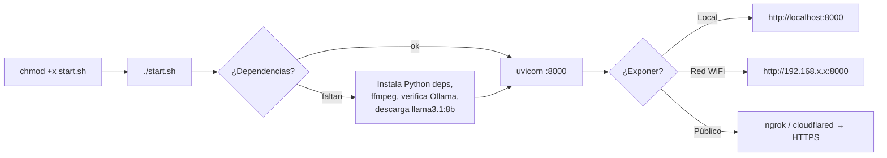

**Requisitos:** Python 3.10+, ffmpeg, Ollama con `llama3.1:8b`, y (hoy) **macOS** para el TTS.

```bash
chmod +x start.sh && ./start.sh          # setup + arranque
# Exponer con HTTPS (necesario para micrófono remoto):
ngrok http 8000
# o
cloudflared tunnel --url http://localhost:8000
```

**Añadir un proyecto evaluable:** crear `proyectos/nombre.md` describiendo tecnologías, endpoints/temas, modelo de datos y decisiones de diseño. El agente lo usará como contexto.

---

*Documento generado a partir del análisis del código fuente y siguiendo la guía de documentación técnica de los Módulos 4 y 5 (LIDR AI4Devs). Todos los diagramas están en Mermaid (diagramas como código) y se renderizan nativamente en GitHub, GitLab, VS Code y Obsidian.*
