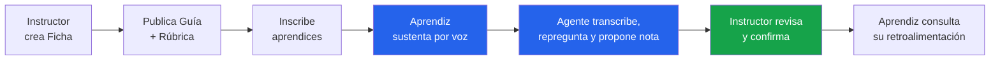
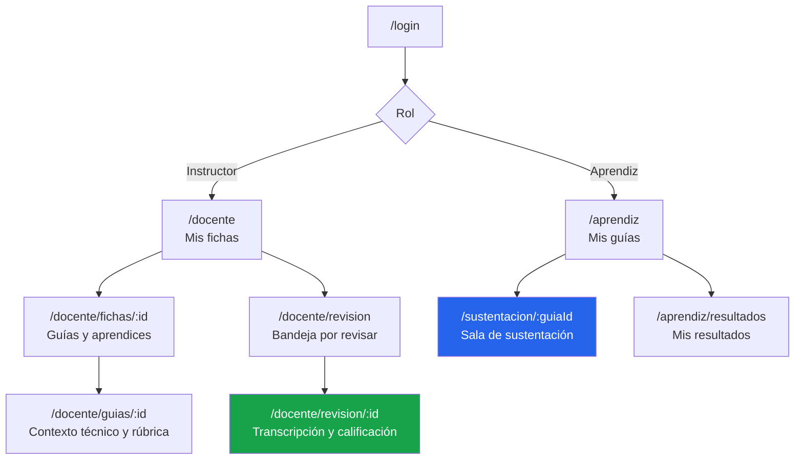
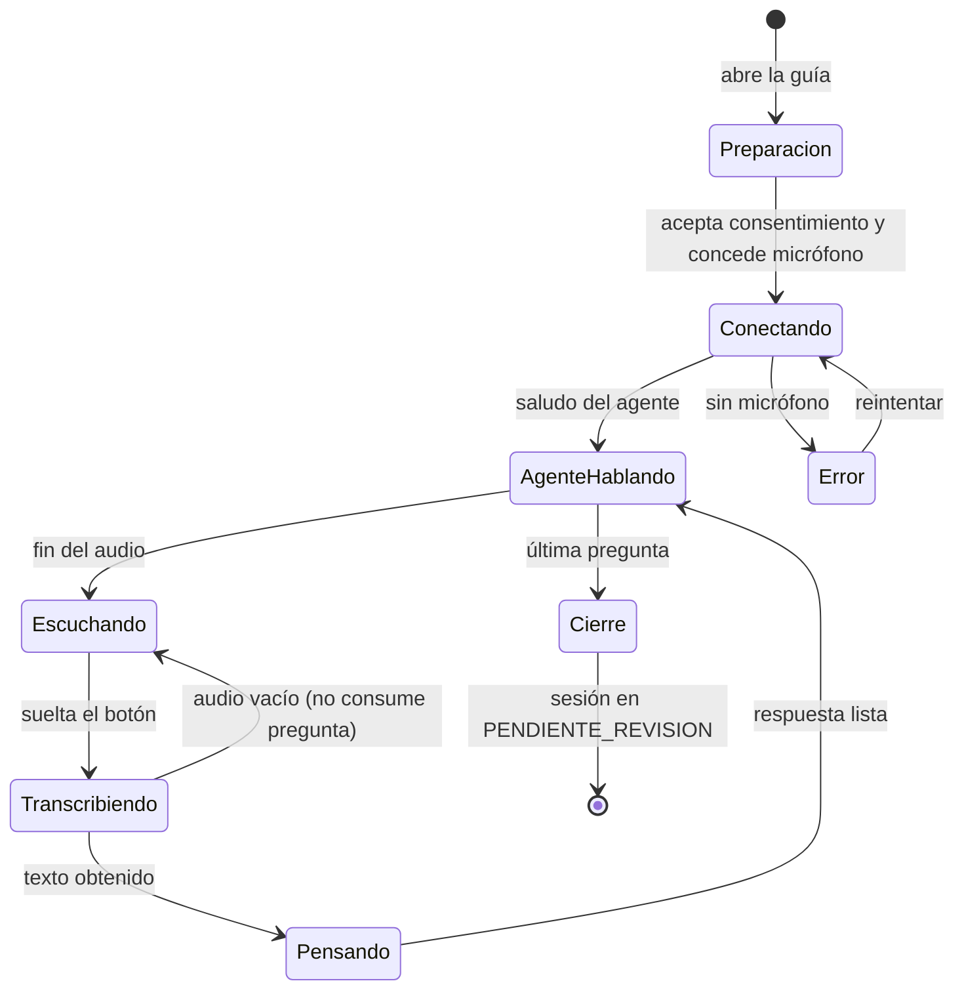
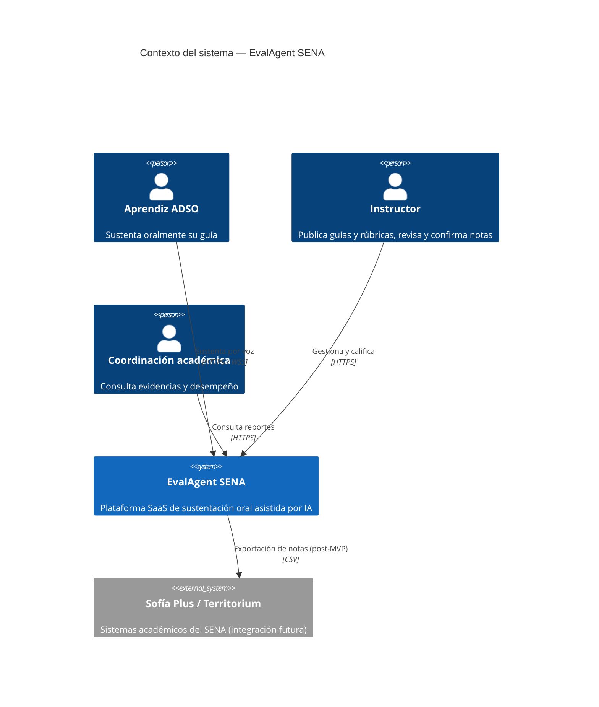
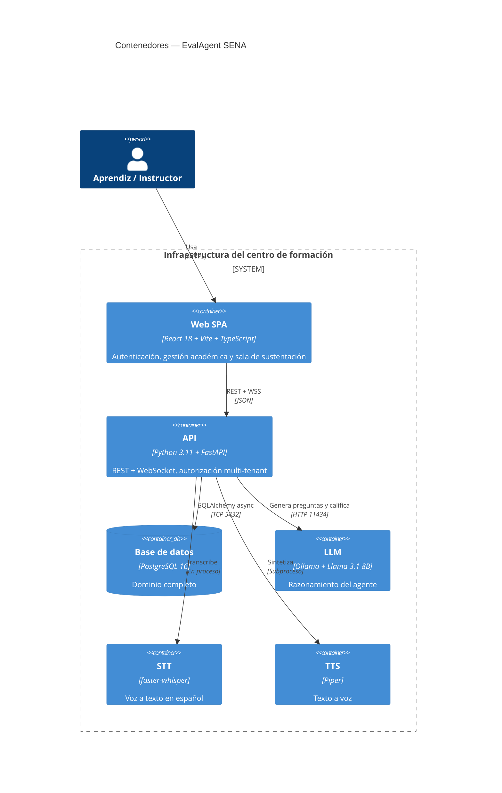
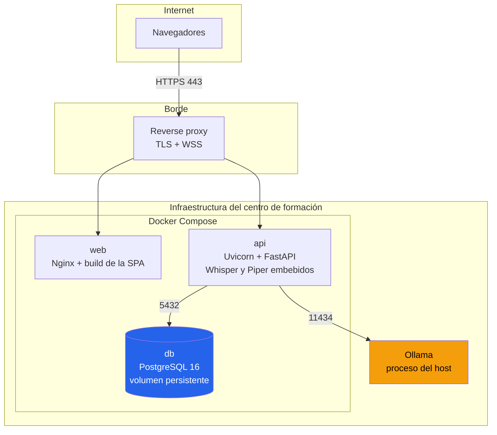
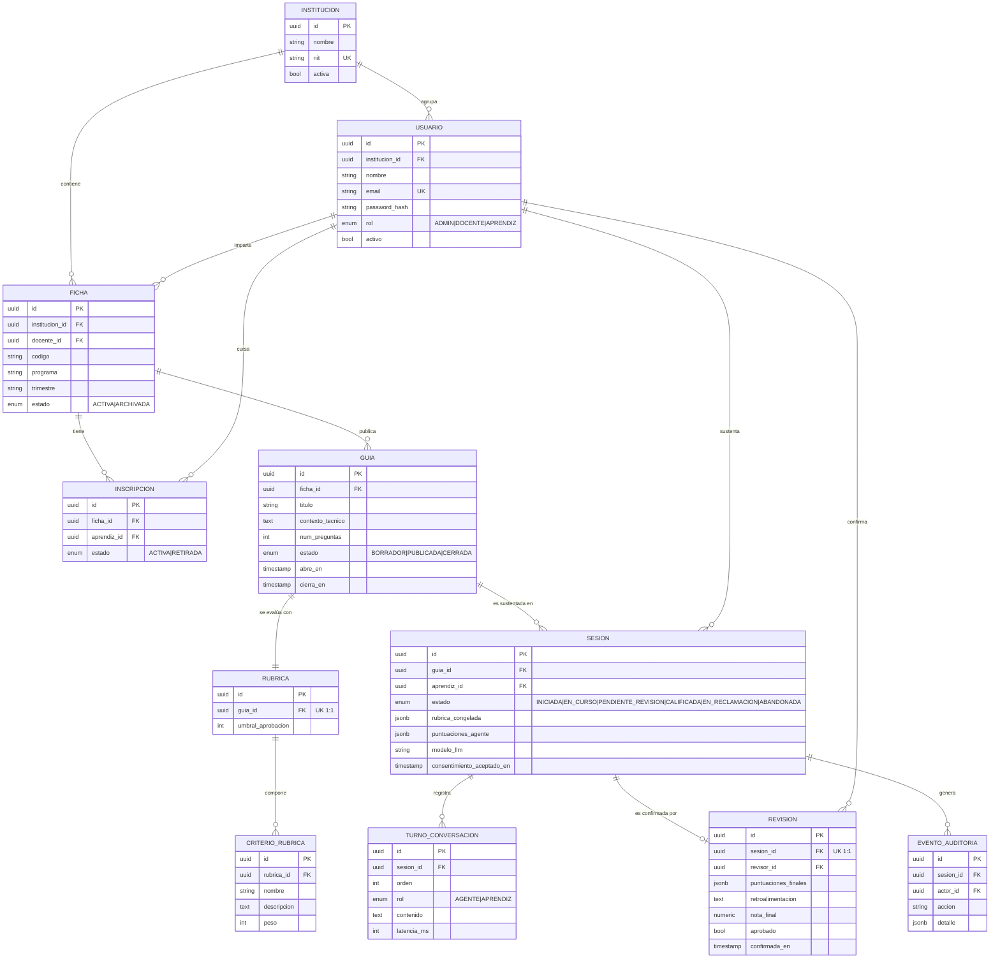

# EvalAgent SENA 🎙️

> Plataforma SaaS de sustentación oral asistida por IA para el programa ADSO del SENA.
> Proyecto final del **Máster AI4Devs** — LIDR Academy.

---

## Índice

0. [Ficha del proyecto](#0-ficha-del-proyecto)
1. [Descripción general del producto](#1-descripción-general-del-producto)
2. [Arquitectura del sistema](#2-arquitectura-del-sistema)
3. [Modelo de datos](#3-modelo-de-datos)
4. [Especificación de la API](#4-especificación-de-la-api)
5. [Historias de usuario](#5-historias-de-usuario)
6. [Tickets de trabajo](#6-tickets-de-trabajo)
7. [Pull requests](#7-pull-requests)

---

## 0. Ficha del proyecto

### 0.1. Nombre completo

**Teo** — iniciales **MAQ**

### 0.2. Nombre del proyecto

**EvalAgent SENA**

### 0.3. Descripción breve del proyecto

Plataforma SaaS multi-tenant, con el modelo mental de Google Classroom, donde los
instructores del SENA publican **guías de aprendizaje** con su rúbrica y sus aprendices las
**sustentan oralmente** ante un agente conversacional de IA.

El agente conduce la sustentación por voz: pregunta, escucha, repregunta según lo que el
aprendiz acaba de decir, y al terminar entrega una transcripción íntegra junto con una
propuesta de calificación contra la rúbrica que definió el instructor.

**La nota final la confirma siempre un instructor.** El sistema no califica solo.

Todo el procesamiento de IA —voz a texto, razonamiento y texto a voz— ocurre **dentro del
centro de formación**: ni un dato personal de aprendices sale hacia servicios de terceros.

### 0.4. URL del proyecto

⏳ *Pendiente de despliegue.* Se publicará en la entrega final, junto con la etiqueta
`v1.0-final-MAQ`. Instrucciones de ejecución local en la [sección 1.4](#14-instrucciones-de-instalación).

### 0.5. URL del repositorio

⏳ *Pendiente de publicación en GitHub.* El historial está versionado en local con la
siguiente estrategia de ramas:

| Entrega | Rama | Contenido |
|---|---|---|
| 1 · Documentación técnica | `feature-entrega1-MAQ` | Producto, arquitectura, modelo de datos, historias y tickets |
| 2 · Código funcional | `feature-entrega2-MAQ` | Backend, frontend y BD conectados |
| Final | `finalproject-MAQ` | Versión desplegada, tests y documentación cerrada |

### 0.6. Estado de la implementación

Este documento corresponde a la **Entrega 1 — documentación técnica**: describe la idea, la
estructura y el diseño del sistema.

| Elemento | Estado en esta rama |
|---|---|
| Documentación (producto, arquitectura, modelo de datos, historias, tickets) | ✅ Completa |
| Código | 🔶 Prototipo v1 — monousuario, sin autenticación, persistencia en ficheros |
| Implementación del diseño v2 descrito aquí | ⏳ Entrega 2 (`feature-entrega2-MAQ`) |
| Despliegue público | ⏳ Entrega final |

> Las secciones 2 a 4 describen la **arquitectura objetivo**, que es lo que evalúa esta
> entrega. El prototipo actual está documentado en
> [`DOCUMENTACION_TECNICA.md`](DOCUMENTACION_TECNICA.md), incluida la lista de discrepancias
> entre su documentación y su código que motivó varios de los tickets de la sección 6.

---

## 1. Descripción general del producto

### 1.1. Objetivo

**El problema.** Un instructor de ADSO lleva entre 3 y 6 fichas simultáneas, con 25–35
aprendices cada una: entre **75 y 210 sustentaciones orales por trimestre**. A 15–20 minutos
cada una, sustentar a todos consume **hasta 40 horas** — una semana completa de trabajo.

La consecuencia es una cadena de problemas:

| # | Problema | Impacto |
|---|---|---|
| **P1** | No hay tiempo material para sustentar a todos | 🔴 Crítico |
| **P2** | El criterio no es uniforme: al aprendiz 28 no se le pregunta como al primero | 🔴 Crítico |
| **P3** | La sustentación es de palabra: no queda evidencia auditable | 🟠 Alto |
| **P4** | Con IA generativa, entregar código ajeno es trivial; la sustentación oral era la única barrera | 🔴 Crítico |
| **P5** | Sin datos estructurados no se puede saber en qué competencia falla una ficha | 🟡 Medio |
| **P6** | Cuadrar horario aprendiz-instructor es un problema logístico, sobre todo en jornada nocturna | 🟡 Medio |

**A quién sirve.**

- **Instructor ADSO** — usuario primario. Recupera tiempo sin renunciar al rigor.
- **Aprendiz ADSO** — usuario primario. Recibe una evaluación uniforme y con retroalimentación
  concreta, independiente del turno que le toque.
- **Coordinación académica** — usuario secundario. Obtiene evidencia auditable del proceso
  evaluativo y métricas agregadas por ficha.

**Qué valor aporta.** Si una sustentación pasa de consumir 15 minutos de instructor a
consumir 3 minutos de revisión asíncrona, un instructor con 118 aprendices pasa de ~30 horas
a ~6 por trimestre. Eso no solo ahorra tiempo: **permite sustentar al 100 % de los
aprendices**, lo que restaura el efecto disuasorio frente a la copia y elimina la
arbitrariedad del muestreo.

**Objetivos medibles**

| # | Objetivo | Línea base | Meta MVP |
|---|---|---|---|
| O1 | Cobertura de sustentación | ~35 % | ≥ 95 % |
| O2 | Tiempo de instructor por sustentación | 15–20 min | ≤ 3 min |
| O3 | Sesiones con evidencia auditable | 0 % | 100 % |
| O4 | Correlación nota-agente ↔ nota-instructor | n/a | ≥ 0,75 |
| O5 | Datos personales enviados fuera de la institución | — | **0 bytes** |
| O6 | Notas confirmadas por un humano | — | **100 %** |

**Lo que este producto NO hace** — delimitar el alcance es parte de definir el problema:

- No sustituye la nota del instructor. Produce una *propuesta*.
- No detecta plagio comparando código (para eso existen MOSS o JPlag).
- No ejecuta ni testea el proyecto entregado. Evalúa el discurso técnico sobre él.
- No es un LMS: no gestiona matrículas oficiales, asistencia ni certificados.
- No usa cámara ni biometría. Solo audio, y sin almacenarlo.

> Análisis completo en [`docs/01-producto/01-problematica.md`](docs/01-producto/01-problematica.md).

### 1.2. Características y funcionalidades principales

**Flujo E2E prioritario**



| # | Funcionalidad | Qué resuelve |
|---|---|---|
| **F1** | **Autenticación y multi-tenancy.** Registro y login con JWT, tres roles (`ADMIN`, `DOCENTE`, `APRENDIZ`) y aislamiento estricto entre instituciones. | Requisito legal (Ley 1581/2012) |
| **F2** | **Gestión académica tipo Classroom.** El instructor crea fichas, inscribe aprendices y publica guías con su contexto técnico y ventana de sustentación. | P1 |
| **F3** | **Rúbrica configurable por guía.** El instructor define sus criterios con pesos que suman 100 y su umbral de aprobación. Sustituye los criterios hardcodeados del prototipo. | P2 |
| **F4** | **Sustentación oral por voz.** El aprendiz conversa con el agente, que repregunta según sus respuestas reales. Transcripción en vivo y reanudación si se cae la conexión. | P1, P4, P6 |
| **F5** | **Calificación asistida con humano en el bucle.** Al cerrar, la sesión queda `PENDIENTE_REVISION` — nunca en nota firme. El instructor ajusta, comenta y confirma. | P2, requisito ético |
| **F6** | **Reportes y auditoría.** Transcripción íntegra, propuesta del agente frente a nota final, y registro inmutable de quién calificó y qué cambió. | P3, P5 |

### 1.3. Diseño y experiencia de usuario

**Principios**

| Principio | Implicación concreta |
|---|---|
| La sala de sustentación no distrae | Pantalla limpia: estado del agente, transcripción y un solo botón. Sin menús. |
| El aprendiz siempre sabe qué pasa | Estados explícitos: *Escuchando · Transcribiendo · Pensando · Hablando*. |
| Nada de sorpresas en la nota | Antes de empezar ve la rúbrica completa y cuántas preguntas habrá. |
| El instructor revisa, no reescribe | La pantalla de revisión trae la propuesta precargada; confirmar es un clic. |
| Accesible | Contraste AA, navegación por teclado y transcripción textual siempre visible, no solo audio. |

**Mapa de navegación**



**Estados de la sala de sustentación**



### 1.4. Instrucciones de instalación

**Requisitos previos:** Docker y Docker Compose · [Ollama](https://ollama.com) en el host ·
8 GB de RAM mínimo (16 GB recomendados).

```bash
git clone <url-del-repositorio> && cd _ProyectoFinal_L1DR

# 1. Configuración
cp .env.example .env
python -c "import secrets; print(secrets.token_urlsafe(48))"   # pega el valor en SECRET_KEY

# 2. Modelo del agente (corre en el host, no en un contenedor — ver ADR-001)
ollama pull llama3.1:8b

# 3. Arranque
docker compose up
```

- Interfaz: <http://localhost:5173>
- API y documentación interactiva: <http://localhost:8000/docs>
- Estado del sistema: <http://localhost:8000/api/v1/health>

<details>
<summary>Desarrollo sin Docker</summary>

```bash
# Backend
cd backend
python -m venv .venv && source .venv/bin/activate
pip install -r requirements-dev.txt
alembic upgrade head
uvicorn app.main:app --reload

# Frontend (otra terminal)
cd frontend
npm install
npm run dev
```
</details>

**Perfiles de hardware**

| Perfil | CPU | RAM | Modelos | Sesiones simultáneas |
|---|---|---|---|---|
| Mínimo | 8 núcleos | 16 GB | Whisper `small` + Llama 3.2 3B | 2–3 |
| Recomendado | 12 núcleos | 32 GB | Whisper `medium` + Llama 3.1 8B | 8–10 |
| Con GPU | 8 núcleos + 8 GB VRAM | 32 GB | Whisper `medium` + Llama 3.1 8B | 15+ |

---

## 2. Arquitectura del sistema

### 2.1. Diagrama de arquitectura

**Nivel 1 — Contexto**



> **Frontera clave:** no existe ninguna flecha hacia un proveedor externo de IA. Es el
> requisito legal del proyecto y su ventaja competitiva.

**Nivel 2 — Contenedores**



**Patrón arquitectónico y por qué**

Arquitectura por capas (*routers → servicios → repositorios → modelos*) sobre un monolito
modular desplegado en contenedores.

| Beneficio | Sacrificio |
|---|---|
| Un equipo de una persona puede razonar sobre todo el sistema | No escala horizontalmente por servicio |
| El aislamiento multi-tenant se impone en una sola capa (el repositorio base), no en N servicios | El estado en memoria (rate limiting, tickets consumidos) asume una sola instancia |
| Despliegue on-premise de un comando, viable para un técnico de centro de formación | Un fallo afecta a todo el sistema |
| Las reglas de negocio no conocen HTTP: son testeables sin levantar servidor | — |

Se descartó una arquitectura de microservicios: la complejidad operativa no se justifica
para decenas de usuarios concurrentes por centro, y contradice la restricción de que el
instructor no es administrador de sistemas.

### 2.2. Descripción de componentes principales

| Componente | Tecnología | Responsabilidad |
|---|---|---|
| **Web SPA** | React 18, Vite, TypeScript, TanStack Query | Toda la interfaz. Rutas protegidas por rol. Cliente HTTP que renueva el token de forma transparente. |
| **API REST** | Python 3.11, FastAPI | CRUD del dominio, autenticación y autorización multi-tenant. OpenAPI generado automáticamente. |
| **Canal WebSocket** | FastAPI WebSocket | Sesión de voz en tiempo real. Autenticado con ticket firmado de un solo uso. |
| **Motor del agente** | Python + httpx | Construye el prompt desde la guía y la rúbrica, orquesta la conversación y propone la calificación. |
| **Servicio STT** | faster-whisper (`medium`, es) | Voz a texto. Corre en *thread pool* para no bloquear el bucle de eventos. |
| **Servicio TTS** | Piper (`es_ES-davefx-medium`) | Texto a voz. Interfaz con motores intercambiables: Piper → `say` → espeak-ng. |
| **Servicio LLM** | Ollama + Llama 3.1 8B | Razonamiento. Corre en el host, no en contenedor. |
| **Persistencia** | PostgreSQL 16, SQLAlchemy 2.0 async, Alembic | Dominio completo con migraciones versionadas. |

### 2.3. Descripción de alto nivel del proyecto y estructura de ficheros

```
.
├── backend/
│   ├── app/
│   │   ├── main.py              # Ensamblado, CORS y traducción de errores a RFC 7807
│   │   ├── core/                # Configuración por entorno, bcrypt y JWT
│   │   ├── db/                  # Base declarativa y sesión async
│   │   ├── models/              # Entidades SQLAlchemy
│   │   ├── schemas/             # Contratos Pydantic de entrada y salida
│   │   ├── repositories/        # Acceso a datos con filtro de tenant OBLIGATORIO
│   │   ├── services/            # Reglas de negocio, agente, STT y TTS
│   │   └── api/v1/              # Routers versionados
│   ├── alembic/                 # Migraciones
│   └── tests/
├── frontend/
│   ├── src/
│   │   ├── api/                 # Cliente HTTP y tipos espejo del backend
│   │   ├── componentes/         # Piezas compartidas
│   │   ├── contextos/           # Estado de autenticación
│   │   ├── hooks/               # useSustentacion: micrófono, WebSocket y audio
│   │   └── paginas/             # Vistas por rol
│   └── legacy/                  # Interfaz del prototipo v1, conservada como referencia
├── docs/                        # Documentación del proyecto (ver índice)
├── prompts.md                   # Registro de uso de IA
└── docker-compose.yml
```

**La estructura sigue una regla:** las dependencias apuntan hacia dentro. Un router conoce
servicios; un servicio conoce repositorios; un repositorio conoce modelos. Nunca al revés.
Por eso los servicios lanzan errores de dominio sin saber nada de HTTP, y `main.py` los
traduce a respuestas.

### 2.4. Infraestructura y despliegue



**Por qué Ollama vive en el host y no en un contenedor:** el acceso a GPU desde contenedor
exige drivers y `nvidia-container-toolkit`, complejidad que un técnico de centro de
formación no tiene por qué resolver. Ollama en el host es un instalador de un clic.

**Proceso de despliegue.** `docker compose up` levanta base de datos, API y frontend. Las
migraciones de Alembic se aplican solas en el arranque del contenedor de la API. La
configuración entra por variables de entorno; `.env` nunca se versiona y `.env.example`
documenta cada variable.

**CI/CD.** GitHub Actions con tres trabajos: *backend* (lint, formato, migraciones
reversibles, tests con cobertura mínima y una comprobación que falla si aparece una llamada
a una API de IA externa), *frontend* (tipos, tests y build) y *docker* (construye ambas
imágenes y verifica que Piper quedó instalado). El trabajo de backend corre en
`ubuntu-latest` deliberadamente: verifica que el sistema ya no depende de macOS.

### 2.5. Seguridad

| Práctica | Implementación |
|---|---|
| **Contraseñas** | bcrypt con coste 12. Nunca aparecen en logs ni en el `__repr__` de los modelos. |
| **Sesiones** | JWT HS256. Token de acceso de 30 min y de refresco de 7 días. Tipados: un refresco no autentica peticiones. |
| **Aislamiento multi-tenant** | El identificador de institución viaja en el *claim* `tid` del token. Los esquemas de entrada **no exponen** ese campo, así que el cliente no puede falsearlo. El repositorio base inyecta el filtro en toda consulta. |
| **Respuestas a recursos ajenos** | `404`, no `403`. Un 403 confirmaría que el recurso existe. |
| **Canal de voz** | Ticket JWT de un solo uso, 60 s de vida, ligado a sesión y aprendiz. En el prototipo bastaba adivinar un identificador para conectarse a la sustentación de cualquiera. |
| **Fuerza bruta** | Límite de 5 intentos por minuto en el login. El login verifica siempre contra un hash, exista o no la cuenta, para que el tiempo de respuesta no revele qué correos están registrados. |
| **CORS** | Lista blanca por entorno. `*` junto a credenciales **aborta el arranque**. |
| **Escalada de privilegios** | El rol lo asigna el servidor. Enviar `"rol": "ADMIN"` en el registro no tiene efecto. |
| **Minimización de datos** | El audio se procesa en memoria y se descarta. Ninguna tabla lo almacena — verificado por test. |
| **Secretos** | Solo por variables de entorno. El arranque falla si `SECRET_KEY` falta, es corta o es un valor obvio. |

### 2.6. Tests

| Suite | Qué cubre |
|---|---|
| **Unitarios** | Selección de motor TTS, emisión y validación de JWT, cálculo ponderado de notas, interpretación de la respuesta del LLM, validación de configuración. |
| **Integración** | Ciclo de autenticación completo, CRUD académico, publicación de guías con sus reglas, y el flujo de revisión y confirmación. |
| **E2E de dominio** | `test_flujo_academico.py` recorre crear ficha → publicar guía con rúbrica → inscribir aprendiz → el aprendiz ve la guía. |

Dos tests merecen mención por su enfoque:

- **`test_aislamiento_multitenant.py`** — parametrizado sobre *todos* los endpoints de
  dominio, cada uno invocado con el rol que sí tiene permiso, de modo que lo único que
  pueda rechazar la petición sea el filtro de tenant. Incluye un guardia que **falla si
  alguien añade un endpoint nuevo y olvida cubrirlo**: el riesgo real no está en el código
  de hoy, sino en el que se escriba dentro de tres semanas.

- **`test_humano_en_el_bucle.py`** — verifica por inspección del árbol sintáctico que la
  única asignación de `EstadoSesion.CALIFICADA` en todo `app/` está dentro de
  `ServicioRevision.confirmar`. Un test funcional probaría los caminos que conocemos; este
  prueba la **ausencia** de otros.

---

## 3. Modelo de datos

### 3.1. Diagrama del modelo de datos



### 3.2. Descripción de entidades principales

**`institucion`** — Tenant raíz. Todo dato del sistema cuelga, directa o indirectamente, de
una institución. Es la unidad de aislamiento del SaaS.

**`usuario`** — El correo es único **globalmente**, no por tenant: una persona, una cuenta.
Lleva `institucion_id` obligatorio con `ON DELETE RESTRICT`. Índice compuesto
`(institucion_id, rol)` porque listar los aprendices de un centro es la consulta más
frecuente del panel docente.

**`ficha`** — Equivale a una clase de Google Classroom. Restricción única
`(institucion_id, codigo)`: el mismo código puede repetirse entre centros, pero no dentro de
uno.

**`guia`** — Sustituye a los ficheros `proyectos/*.md` del prototipo. Su campo
`contexto_tecnico` es la pieza clave: **es lo que se inyecta en el prompt del agente** y lo
que ancla las preguntas al temario real.

**`rubrica` / `criterio_rubrica`** — Sustituyen al diccionario de criterios hardcodeado del
prototipo. Relación 1:1 con la guía. Invariante de negocio: los pesos suman exactamente 100,
validado en la capa de servicio para poder devolver un `422` con un mensaje útil.

**`sesion`** — Una sustentación. Dos campos merecen explicación:

- `rubrica_congelada` (JSONB) — **copia inmutable de la rúbrica en el momento de sustentar**.
  Si el instructor la edita a mitad de trimestre, las notas ya emitidas siguen cuadrando y
  siendo defendibles ante una reclamación. Es el mismo patrón que aplica una factura al
  congelar precio y datos fiscales.
- `puntuaciones_agente` (JSONB) — la propuesta del agente. Se conserva aunque el instructor
  la modifique: es la evidencia de que hubo supervisión humana real.

**No existe ninguna columna de audio.** Solo se persiste la transcripción textual.

**`turno_conversacion`** — Una fila por intervención, con `UNIQUE (sesion_id, orden)`.

**`revision`** — Relación 1:1 con la sesión. **Su existencia es lo que distingue una nota
publicada de una simple propuesta.** Sin fila aquí, la sesión no puede llegar a `CALIFICADA`.

**`evento_auditoria`** — Append-only. Registra inicio y cierre de sesión, confirmación de
nota con el diferencial respecto a la propuesta, reclamaciones e intentos de acceso cruzado
entre instituciones.

**Reglas de integridad destacadas**

| # | Regla | Dónde se aplica |
|---|---|---|
| RI-1 | Los pesos de una rúbrica suman 100 | Servicio (`422`) |
| RI-2 | Una guía no se publica sin rúbrica ni sin contexto técnico | Servicio (`422`) |
| RI-4 | Una sesión no llega a `CALIFICADA` sin fila en `revision` | Servicio + test de AST |
| RI-5 | Toda consulta de dominio filtra por el tenant del token | Repositorio base |
| RI-7 | Un aprendiz tiene como máximo una sesión no abandonada por guía | Índice parcial único en Postgres |

```sql
CREATE UNIQUE INDEX idx_sesion_unica_por_guia
    ON sesion (guia_id, aprendiz_id)
    WHERE estado <> 'ABANDONADA';
```

> Detalle completo, índices y política de retención en
> [`docs/04-arquitectura/02-modelo-datos.md`](docs/04-arquitectura/02-modelo-datos.md).

---

## 4. Especificación de la API

Base: `/api/v1` · Autenticación `Bearer` · Errores conforme a **RFC 7807** ·
OpenAPI 3.1 en `/docs`.

A continuación los tres endpoints que sostienen el flujo principal. Contrato completo en
[`docs/05-api/01-especificacion-api.md`](docs/05-api/01-especificacion-api.md).

### 4.1. `POST /api/v1/sesiones` — Iniciar una sustentación

```yaml
post:
  summary: Inicia la sustentación de una guía y emite el ticket del canal de voz
  security: [{ bearerAuth: [] }]
  requestBody:
    content:
      application/json:
        schema:
          type: object
          required: [guia_id, consentimiento_aceptado]
          properties:
            guia_id: { type: string, format: uuid }
            consentimiento_aceptado:
              type: boolean
              description: Sin aceptación explícita la sesión no se crea (Ley 1581/2012)
  responses:
    "201":
      description: Sesión creada
      content:
        application/json:
          example:
            id: "b2f9c1a0-3e4d-4f5a-8b7c-1d2e3f4a5b6c"
            estado: "INICIADA"
            guia_titulo: "API REST de gestión de tareas"
            num_preguntas: 8
            rubrica_congelada:
              umbral_aprobacion: 60
              criterios:
                - { nombre: "Endpoints", peso: 25 }
                - { nombre: "Manejo de errores", peso: 20 }
            ws_ticket: "eyJhbGciOiJIUzI1NiIs..."   # un solo uso, caduca en 60 s
            ws_url: "/api/v1/ws/sesiones/b2f9c1a0-..."
    "403": { description: Sin inscripción activa o fuera de la ventana de sustentación }
    "409": { description: Ya sustentaste esta guía }
    "422": { description: Consentimiento no aceptado }
```

### 4.2. `WS /api/v1/ws/sesiones/{id}?ticket=<jwt>` — Canal de voz

**Mensajes del cliente**

| Tipo | Cuerpo |
|---|---|
| `audio_chunk` | `{ "audio": "<base64>", "mime_type": "audio/webm" }` — máx. 10 MB |
| `latido` | `{}` |
| `finalizar` | `{}` |

**Mensajes del servidor**

| Tipo | Cuerpo |
|---|---|
| `mensaje_agente` | `{ texto, audio, pregunta_num, total_preguntas, es_final }` |
| `transcripcion_aprendiz` | `{ texto }` |
| `transcripcion_vacia` | `{}` — no consume pregunta |
| `estado_agente` | `{ estado: "transcribiendo" \| "pensando" }` |
| `evaluacion_completa` | `{ sesion_id, estado: "PENDIENTE_REVISION", mensaje }` |

**Códigos de cierre:** `4401` ticket inválido, caducado o ya consumido · `4403` el ticket no
corresponde a este aprendiz · `4409` la sesión no admite conversación · `1011` error interno.

> `evaluacion_completa` **nunca transporta puntuaciones**. Es la materialización en el
> protocolo del principio de humano en el bucle.

### 4.3. `POST /api/v1/sesiones/{id}/revision` — Confirmar la calificación

```yaml
post:
  summary: Confirma la nota y la publica al aprendiz
  description: |
    Única vía por la que una sesión llega al estado CALIFICADA.
    Solo el instructor dueño de la ficha puede invocarlo.
  security: [{ bearerAuth: [] }]
  requestBody:
    content:
      application/json:
        example:
          puntuaciones_finales:
            Endpoints: 8
            Manejo de errores: 6
            Diseño: 7
            Seguridad: 5
            Explicación: 9
          retroalimentacion: >-
            Explicas muy bien el flujo general y las rutas. Refuerza los códigos
            de estado: confundiste 401 con 403.
  responses:
    "200":
      content:
        application/json:
          example:
            sesion_id: "b2f9c1a0-..."
            estado: "CALIFICADA"
            nota_final: 71.5
            aprobado: true
            confirmada_en: "2026-09-12T16:04:00-05:00"
            diferencias_con_agente:      # evidencia de supervisión humana efectiva
              Seguridad:   { agente: 3, final: 5 }
              Explicación: { agente: 7, final: 9 }
    "403": { description: No eres el instructor de esta ficha }
    "422": { description: Las puntuaciones no cubren los criterios de la rúbrica }
```

---

## 5. Historias de usuario

Formato estándar con criterios de aceptación en **Gherkin** y evaluación **INVEST**.
Las 16 historias completas están en
[`docs/02-backlog/02-historias-usuario.md`](docs/02-backlog/02-historias-usuario.md).

### Historia de usuario 1 — HU-09 · Conversar por voz con el agente

> **Como** aprendiz
> **quiero** responder hablando y que el agente repregunte sobre lo que dije
> **para** demostrar que entiendo mi proyecto de verdad.

**Prioridad:** 🔴 Must-Have · **Épica:** E3 Sustentación por voz · **Estimación:** XL (13)

```gherkin
Escenario: Turno completo de conversación
  Dado que estoy en una sesión activa
  Cuando grabo mi respuesta y la envío
  Entonces veo mi respuesta transcrita en pantalla en menos de 4 segundos
  Y el agente responde con audio y texto en menos de 6 segundos (p95)
  Y su pregunta hace referencia explícita a algo que acabo de decir

Escenario: Audio vacío o inaudible
  Dado que estoy en una sesión activa
  Cuando envío un audio sin voz
  Entonces el agente me pide que repita, sin consumir una pregunta

Escenario: El agente nunca se sale del papel
  Dado que respondo algo confuso o fuera de tema
  Cuando el agente contesta
  Entonces nunca dice "no puedo continuar", "como IA" ni similares
  Y reconduce hacia el temario de la guía

Escenario: El agente no da la respuesta
  Dado que digo "no sé, dime tú la respuesta"
  Cuando el agente contesta
  Entonces no revela la respuesta correcta
  Y reformula la pregunta o pasa a la siguiente

Escenario: Cierre de la sustentación
  Dado que he respondido las 8 preguntas de la guía
  Cuando envío la última respuesta
  Entonces el agente cierra señalando fortalezas y un área de mejora
  Y no revela ninguna nota
  Y la sesión pasa a estado PENDIENTE_REVISION

Escenario: No se almacena el audio crudo
  Dado que he terminado la sustentación
  Cuando reviso lo persistido en base de datos
  Entonces solo existen las transcripciones textuales, ningún fichero de audio
```

**INVEST** — **I:** depende solo de HU-08 · **N:** el número de preguntas y el tono son
negociables · **V:** es el núcleo del producto · **E:** el mayor riesgo de estimación por la
cadena STT→LLM→TTS · **S:** ⚠️ **incumple el criterio Small** con 13 puntos; es candidata a
dividirse en HU-09a (canal y transcripción), HU-09b (motor conversacional) y HU-09c
(síntesis de voz) · **T:** los escenarios deterministas se automatizan; el comportamiento
del LLM se verifica con revisión manual sobre sesiones reales.

---

### Historia de usuario 2 — HU-12 · Revisar y confirmar la calificación

> **Como** instructor
> **quiero** revisar la transcripción y la propuesta de nota del agente antes de publicarla
> **para** que la decisión final sea mía y pueda defenderla.

**Prioridad:** 🔴 Must-Have · **Épica:** E4 Evaluación y rúbricas · **Estimación:** L (8)

```gherkin
Escenario: Revisión y confirmación
  Dado que hay una sesión en estado PENDIENTE_REVISION
  Cuando la abro
  Entonces veo la transcripción íntegra, la puntuación propuesta por criterio
    y la nota resultante
  Y puedo modificar cualquier puntuación y escribir una retroalimentación
  Cuando confirmo
  Entonces la sesión pasa a CALIFICADA
  Y queda registrado quién confirmó, cuándo, y qué puntuaciones cambió
    respecto a la propuesta

Escenario: Ninguna nota se publica sin humano
  Dado que una sesión terminó hace una semana sin que nadie la revisara
  Cuando el aprendiz consulta su resultado
  Entonces ve "Pendiente de revisión del instructor"
  Y en ningún caso ve la puntuación propuesta por el agente

Escenario: Solo el instructor de la ficha puede calificar
  Dado que soy instructor de otra ficha de la misma institución
  Cuando intento confirmar esta sesión
  Entonces recibo un 403

Escenario: Reclamación
  Dado que una sesión ya está CALIFICADA
  Cuando el aprendiz la marca como reclamada
  Entonces la sesión pasa a EN_RECLAMACION y se notifica al instructor
```

**INVEST** — **I:** depende de HU-09 y HU-11 · **N:** el nivel de detalle de la auditoría es
negociable · **V:** es el requisito ético y legal innegociable (Art. 22 RGPD) · **E:** patrón
conocido · **S:** una pantalla y un endpoint · **T:** completamente automatizable.

---

### Historia de usuario 3 — HU-11 · Definir la rúbrica de una guía

> **Como** instructor
> **quiero** definir mis propios criterios de evaluación con sus pesos
> **para** que todos mis aprendices se midan con la misma vara, y que sea la mía.

**Prioridad:** 🔴 Must-Have · **Épica:** E4 Evaluación y rúbricas · **Estimación:** L (8)

```gherkin
Escenario: Crear rúbrica
  Dado que soy instructor y tengo la guía "API REST de gestión de tareas"
  Cuando defino 5 criterios con nombre, descripción y peso que suman 100 %
  Entonces la rúbrica queda asociada a esa guía
  Y sustituye a cualquier criterio por defecto

Escenario: Los pesos deben sumar 100
  Dado que estoy editando una rúbrica
  Cuando los pesos suman 90 %
  Entonces recibo un 422 y no se guarda

Escenario: La rúbrica dirige la calificación del agente
  Dado que la rúbrica tiene el criterio "manejo de errores" con peso 30 %
  Cuando el agente califica una sesión de esa guía
  Entonces el reporte incluye una puntuación de 0 a 10 para "manejo de errores"
  Y ese criterio pondera un 30 % en la nota total

Escenario: Umbral de aprobación configurable
  Dado que fijo el umbral de la guía en 70 %
  Cuando una sesión obtiene 68 %
  Entonces se marca como NO APROBADA
```

**INVEST** — **I:** depende de HU-07 · **N:** escala 0-10 frente a niveles cualitativos, es
negociable · **V:** resuelve directamente el problema P2 · **E:** CRUD anidado más un cambio
en el prompt de calificación · **S:** un recurso · **T:** el cálculo ponderado se verifica
con casos aritméticos.

---

## 6. Tickets de trabajo

Estructura conforme al Módulo 5: título, descripción, alcance técnico, criterios de
aceptación, estimación, dependencias y definición de terminado. Los 13 tickets están en
[`docs/03-tickets/`](docs/03-tickets/README.md).

### Ticket 1 — T-011 · Revisión y confirmación humana de la calificación

| Campo | Valor |
|---|---|
| **Tipo** | Característica (backend) |
| **Historia** | HU-12 |
| **Prioridad** | 🔴 Crítica |
| **Estimación** | 5 pts |
| **Componente** | `backend/app/api/v1/revisiones.py` · `backend/app/services/sesion.py` |

**Descripción.** Implementar el humano en el bucle. No es una funcionalidad opcional: es lo
que hace el sistema legalmente admisible bajo el Art. 22 del RGPD y el AI Act, que prohíben
la decisión totalmente automatizada con efecto significativo sobre una persona.

**Alcance técnico**

- Modelo `Revision` con `puntuaciones_finales`, `puntuaciones_agente` (congeladas),
  `retroalimentacion`, `nota_final`, `aprobado` y `confirmada_en`.
- `GET /sesiones/{id}/revision` → transcripción más propuesta del agente.
- `POST /sesiones/{id}/revision` → confirma y publica.
- Solo el instructor dueño de la ficha puede confirmar.
- Registro de auditoría inmutable con el diferencial entre propuesta y nota final.
- El aprendiz consulta el resultado **solo** si el estado es `CALIFICADA`.

**Criterios de aceptación**

- [ ] Una sesión `PENDIENTE_REVISION` no expone ninguna nota al aprendiz.
- [ ] Confirmar cambia el estado a `CALIFICADA` y registra revisor, fecha y diferencias.
- [ ] Un instructor de otra ficha recibe `403`.
- [ ] Las puntuaciones del agente se conservan aunque el instructor las modifique.
- [ ] **No existe ninguna ruta de código que lleve una sesión a `CALIFICADA` sin revisión
      humana** — verificado por búsqueda exhaustiva sobre el código, no solo con tests.

**Definición de terminado.** Tests que cubren las 6 transiciones de estado · auditoría
verificada · el último criterio validado por inspección del árbol sintáctico de todo `app/`.

**Dependencias.** Requiere T-009 (motor del agente) y T-010 (rúbrica configurable).

---

### Ticket 2 — T-004 · Aislamiento multi-tenant por institución

| Campo | Valor |
|---|---|
| **Tipo** | Tarea técnica (seguridad) |
| **Historia** | HU-03 |
| **Prioridad** | 🔴 Crítica |
| **Estimación** | 5 pts |
| **Componente** | `backend/app/api/deps.py` · `backend/app/repositories/` |

**Descripción.** Garantizar que ningún usuario pueda leer ni modificar datos de otra
institución. Es un requisito legal (Ley 1581/2012), no una mejora. La regla de oro: **el
tenant se deriva siempre del token JWT, nunca de un parámetro que envíe el cliente**.

**Alcance técnico**

- Dependencia `institucion_actual()` que extrae el *claim* `tid` del token.
- Clase base `RepositorioTenant` cuyos métodos inyectan `WHERE institucion_id = :tid` de
  forma obligatoria. Guías y sesiones lo resuelven por JOIN con la ficha.
- Los esquemas Pydantic de entrada **no exponen** `institucion_id`.
- El acceso cruzado responde `404`, no `403`.
- Test parametrizado que recorre **todos** los endpoints de dominio con un usuario de otra
  institución y exige `404` en todos.

**Criterios de aceptación**

- [ ] `GET /fichas/{id}` de otra institución devuelve `404`.
- [ ] Los listados devuelven exclusivamente recursos del tenant del token.
- [ ] Enviar `institucion_id` ajeno en el cuerpo de un `POST` se ignora.
- [ ] El test parametrizado cubre el 100 % de los endpoints de dominio y falla si se añade
      uno nuevo sin cubrir.

**Definición de terminado.** Test parametrizado en verde en CI · revisión de seguridad · cero
incidencias de acceso cruzado.

**Dependencias.** Requiere T-003 (JWT). Bloquea todo el dominio académico.

---

### Ticket 3 — T-012 · TTS multiplataforma con Piper

| Campo | Valor |
|---|---|
| **Tipo** | 🐞 Bug / deuda técnica **D1** |
| **Historia** | HU-16 |
| **Prioridad** | 🔴 Alta |
| **Estimación** | 5 pts |
| **Componente** | `backend/app/services/tts.py` |

**Descripción.** **El defecto:** el README y `start.sh` del prototipo afirmaban que el
sistema usaba Piper con la voz `es_ES-davefx-medium`, e incluso `start.sh` lo descargaba.
Pero `backend/tts.py` invocaba el comando `say` de macOS. Resultado: **el sistema era mudo
en Linux**, justo donde hay que desplegarlo para la entrega final.

La causa de fondo no fue elegir `say`, sino **llamarlo directamente desde la lógica de
negocio**, sin abstracción que permitiera sustituirlo.

**Alcance técnico**

- Interfaz `MotorTTS` con implementaciones `PiperTTS`, `SayTTS` y `EspeakTTS`.
- Selección en el arranque por disponibilidad real, en orden Piper → say → espeak-ng.
- Variable `TTS_ENGINE` para forzar un motor concreto; si se fuerza uno ausente, el arranque
  **aborta** en lugar de caer en silencio a otro.
- Sin ningún motor disponible, el sistema sigue en **modo solo texto** y lo avisa: una
  sustentación sin voz es peor, pero es mejor que ninguna sustentación.
- El motor activo se expone en `/api/v1/health`.
- Piper y su modelo de voz se instalan en la imagen Docker.

**Criterios de aceptación**

- [ ] En un contenedor Linux con Piper, sintetizar devuelve WAV válido de más de 0 bytes.
- [ ] Sin Piper y en macOS, cae a `say` y lo registra en el log.
- [ ] Sin ningún motor, la sesión continúa en modo solo texto con aviso en la interfaz.
- [ ] `TTS_ENGINE=piper` sin Piper instalado falla al arrancar, de forma explícita.
- [ ] La suite pasa en `ubuntu-latest` en CI.
- [ ] README y documentación técnica reflejan el comportamiento real.

**Definición de terminado.** Tests por motor con el binario simulado · CI en verde en Ubuntu ·
deuda **D1** cerrada · documentación corregida.

**Dependencias.** Ninguna: se puede abordar en paralelo desde el primer día. Bloquea el
despliegue público.

---

## 7. Pull requests

⏳ *Pendientes de apertura.* El repositorio aún no está publicado en GitHub; el historial
está versionado en local con la estrategia de ramas de la [sección 0.5](#05-url-del-repositorio).

Al publicar, se abrirá un pull request por entrega, cada uno con título claro, descripción de
qué cambia y por qué, e impacto:

**Pull Request 1 — Entrega 1 · Documentación técnica**
`feature-entrega1-MAQ` → `main`. Documentación completa del rediseño a plataforma SaaS:
problemática, PRD, Lean Canvas, 6 épicas, 16 historias con Gherkin e INVEST, backlog
priorizado con MoSCoW y WSJF, 13 tickets, modelo C4, modelo de datos, 7 ADRs y
especificación de la API.

**Pull Request 2 — Entrega 2 · Código funcional**
`feature-entrega2-MAQ` → `main`. Backend por capas con PostgreSQL y JWT multi-tenant, 28
endpoints REST más el canal WebSocket de voz, frontend React con TypeScript, tests y CI.
Cierra las deudas técnicas D1 (TTS solo en macOS), D6 (CORS con comodín), D7 (estado en
memoria) y D8 (criterios hardcodeados).

**Pull Request 3 — Entrega final**
`finalproject-MAQ` → `main`. Despliegue público, test E2E del flujo principal, gestión de
secretos y documentación cerrada. Etiqueta `v1.0-final-MAQ`.

---

## Documentación complementaria

| Documento | Contenido |
|---|---|
| [`docs/`](docs/README.md) | Índice general con la trazabilidad problema → épica → historia → ticket → test |
| [`docs/01-producto/`](docs/01-producto/01-problematica.md) | Problemática, PRD completo y Lean Canvas |
| [`docs/02-backlog/`](docs/02-backlog/02-historias-usuario.md) | 6 épicas, 16 historias y backlog priorizado |
| [`docs/03-tickets/`](docs/03-tickets/README.md) | 13 tickets técnicos con grafo de dependencias |
| [`docs/04-arquitectura/`](docs/04-arquitectura/01-arquitectura.md) | C4 en 4 niveles, modelo de datos y 7 ADRs |
| [`docs/05-api/`](docs/05-api/01-especificacion-api.md) | Contrato REST y WebSocket completo |
| [`prompts.md`](prompts.md) | Prompts clave por sección, evolución del prompt del agente y errores que cometió la IA |
| [`DOCUMENTACION_TECNICA.md`](DOCUMENTACION_TECNICA.md) | Documentación del prototipo v1, conservada como referencia histórica |

---

*Proyecto final del Máster AI4Devs — LIDR Academy · Teo (MAQ)*
