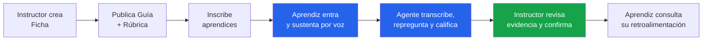
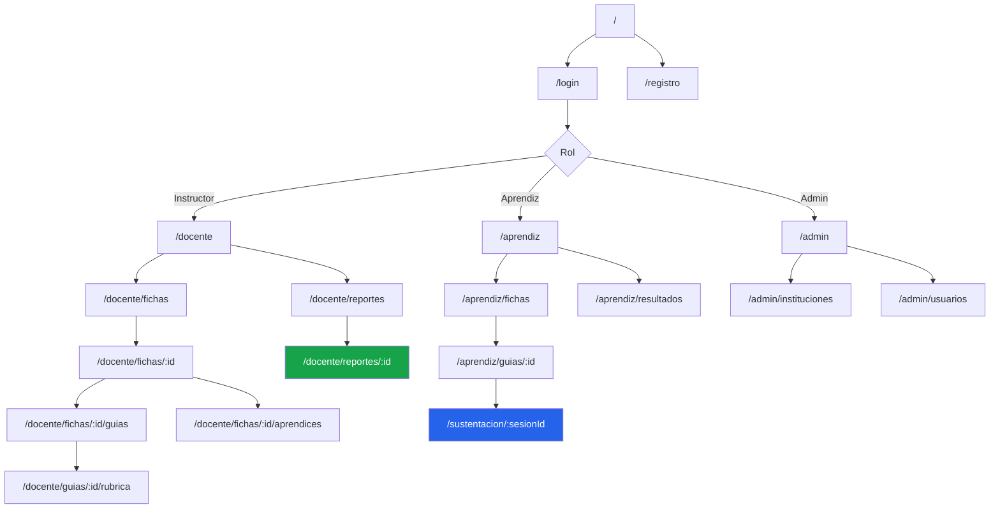
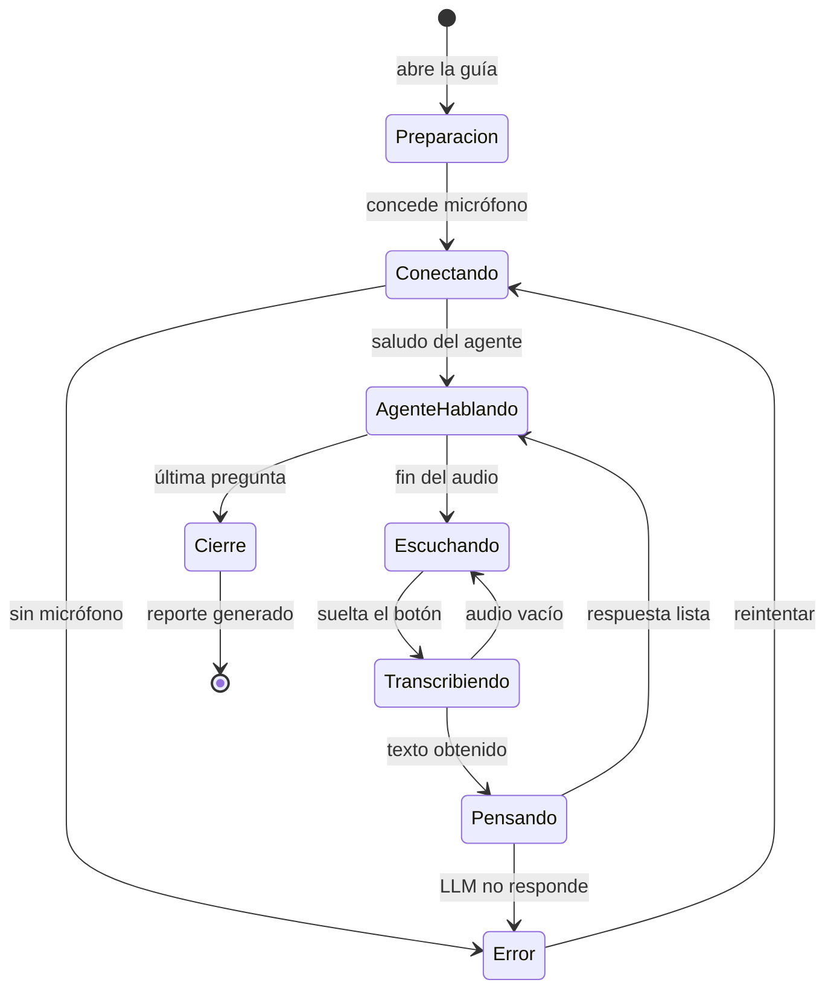

# 02 — PRD · Documento de Requisitos de Producto

> **EvalAgent SENA** — Plataforma SaaS de sustentación oral asistida por IA
> Estado: `Aprobado` · Versión: `2.0` · Autor: Teo · Fecha: 2026-08-02

<!-- Estructura conforme a los componentes clave de un PRD definidos en el
     Módulo 5 del Máster AI4Devs (LIDR Academy), incluida su doble función:
     documento de alineación humana + especificación ejecutable para agentes de IA. -->

---

## Tabla de contenidos

1. [Introducción y objetivos](#1-introducción-y-objetivos)
2. [Stakeholders](#2-stakeholders)
3. [Personas y jobs-to-be-done](#3-personas-y-jobs-to-be-done)
4. [Alcance del MVP](#4-alcance-del-mvp)
5. [Componentes principales y sitemap](#5-componentes-principales-y-sitemap)
6. [Características y funcionalidades](#6-características-y-funcionalidades)
7. [Diseño y experiencia de usuario](#7-diseño-y-experiencia-de-usuario)
8. [Requisitos técnicos](#8-requisitos-técnicos)
9. [Métricas de éxito (KPIs)](#9-métricas-de-éxito-kpis)
10. [Riesgos](#10-riesgos)
11. [Non-goals](#11-non-goals)
12. [Planificación por fases](#12-planificación-por-fases)
13. [Criterios de aceptación del producto](#13-criterios-de-aceptación-del-producto)

---

## 1. Introducción y objetivos

### 1.1 Resumen ejecutivo

**EvalAgent SENA** es una plataforma SaaS multi-tenant, tipo Google Classroom, donde
instructores del SENA publican **guías de aprendizaje** y sus aprendices **sustentan
oralmente** los proyectos asociados frente a un agente conversacional de IA.

El agente conduce la sustentación por voz: pregunta, escucha, repregunta según lo que el
aprendiz responde, y al terminar produce una **transcripción completa + una propuesta de
calificación** contra una rúbrica que el instructor definió. El instructor solo revisa,
ajusta y confirma.

Todo el procesamiento de IA (voz a texto, razonamiento y texto a voz) corre **en local**,
sin enviar datos de aprendices a servicios de terceros.

### 1.2 Problema

Ver [`01-problematica.md`](01-problematica.md) para el análisis completo.

En una frase: *los instructores no pueden sustentar oralmente a 100+ aprendices por
trimestre, y cuando lo hacen el criterio no es uniforme ni queda evidencia auditable.*

### 1.3 Objetivos

| # | Objetivo | Tipo | Medición |
|---|---|---|---|
| **O1** | Que el 100 % de los aprendices pueda sustentar oralmente | Negocio | Cobertura de sustentación |
| **O2** | Reducir el tiempo de instructor por sustentación a ≤ 3 min | Negocio | Tiempo medio de revisión |
| **O3** | Garantizar criterio uniforme mediante rúbrica explícita | Calidad | Desviación entre evaluaciones de la misma ficha |
| **O4** | Dejar evidencia auditable de cada sustentación | Cumplimiento | % de sesiones con transcripción íntegra |
| **O5** | No enviar datos personales de aprendices fuera de la institución | Cumplimiento | 0 llamadas a APIs externas de IA |
| **O6** | Mantener siempre la decisión final en un humano | Ético/legal | 100 % de notas confirmadas por instructor |

### 1.4 Visión a 12 meses

> Que cualquier centro de formación del SENA pueda levantar su propia instancia de
> EvalAgent, con sus fichas y sus rúbricas, y que la sustentación oral deje de ser
> un privilegio del muestreo para volver a ser parte estándar de la evaluación.

---

## 2. Stakeholders

| Stakeholder | Rol en el producto | Interés principal | Influencia |
|---|---|---|---|
| **Instructor ADSO** | Usuario primario | Recuperar tiempo sin perder rigor | 🔴 Alta |
| **Aprendiz ADSO** | Usuario primario | Evaluación justa y con feedback | 🔴 Alta |
| **Coordinación académica** | Usuario secundario | Evidencia auditable y métricas por ficha | 🟠 Media |
| **Administrador de la instancia** | Usuario de soporte | Alta de instituciones, usuarios y operación | 🟠 Media |
| **Área de TI del centro** | Facilitador | Despliegue, backups, no depender de la nube | 🟡 Media-baja |
| **Oficina de protección de datos** | Regulador interno | Cumplimiento Ley 1581/2012 | 🟠 Media |
| **Equipo de desarrollo (1 persona)** | Constructor | Alcance realista para ~30 h de dedicación | 🔴 Alta |

---

## 3. Personas y jobs-to-be-done

### Persona 1 — Carolina, instructora ADSO
- **Contexto:** 41 años, 12 años en el SENA, 4 fichas activas, 118 aprendices.
- **Nivel técnico:** alto en desarrollo, bajo en administración de sistemas.
- **JTBD:** *«Cuando termina el trimestre y tengo 118 proyectos entregados, quiero
  verificar que cada aprendiz entiende lo que entregó, para poder poner una nota
  defendible sin perder una semana entera.»*

### Persona 2 — Jhon, aprendiz ADSO
- **Contexto:** 19 años, ficha 2758421, jornada nocturna, trabaja de día.
- **Nivel técnico:** en formación.
- **JTBD:** *«Cuando entrego mi proyecto, quiero demostrar que lo entiendo en igualdad
  de condiciones que mis compañeros, para que mi nota refleje mi esfuerzo y no el
  turno que me tocó.»*

### Persona 3 — Marta, coordinadora académica
- **Contexto:** supervisa 14 instructores y ~40 fichas.
- **JTBD:** *«Cuando llega la auditoría de calidad, quiero poder mostrar la evidencia
  del proceso evaluativo de cualquier aprendiz, para sostener la certificación del
  centro.»*

---

## 4. Alcance del MVP

### 4.1 Flujo E2E prioritario

> **El aprendiz sustenta su guía por voz ante el agente y el instructor confirma la nota
> con la evidencia delante.**

### 4.2 Historias del MVP

| Prioridad | Historias | Detalle |
|---|---|---|
| **Must-Have** | HU-01 · HU-02 · HU-03 · HU-05 · HU-07 · HU-08 · HU-09 · HU-11 · HU-12 · HU-15 · HU-16 | [Ver backlog](../02-backlog/02-historias-usuario.md) |
| **Should-Have** | HU-06 · HU-10 · HU-13 | Opcionales del MVP |
| **Could-Have** | HU-04 · HU-14 | Post-MVP |

---

## 5. Componentes principales y sitemap

### 5.1 Componentes del sistema

| Componente | Responsabilidad |
|---|---|
| **Web SPA** (React) | Toda la interfaz: autenticación, gestión académica, sala de sustentación |
| **API REST** (FastAPI) | CRUD de dominio, autenticación, autorización multi-tenant |
| **Canal WebSocket** | Sesión de sustentación en tiempo real (audio ↔ texto ↔ audio) |
| **Motor de agente** | Orquesta la conversación, decide la siguiente pregunta, califica |
| **Servicio STT** | Whisper local — audio del aprendiz a texto |
| **Servicio TTS** | Piper local — texto del agente a audio |
| **Servicio LLM** | Ollama local — razonamiento del agente |
| **PostgreSQL** | Persistencia de todo el dominio |

---

## 6. Características y funcionalidades

### F1 · Autenticación y multi-tenancy
- Registro e inicio de sesión con correo y contraseña (hash bcrypt).
- Tokens JWT de acceso (30 min) y refresco (7 días).
- Tres roles: `ADMIN`, `DOCENTE`, `APRENDIZ`.
- **Aislamiento por institución:** ningún usuario puede leer datos de otra institución.

### F2 · Gestión académica (tipo Classroom)
- El instructor crea **fichas** (equivalente a un curso/clase).
- Inscribe aprendices en la ficha; cada aprendiz ve solo sus fichas.
- Publica **guías de aprendizaje** dentro de una ficha, con su enunciado y contexto técnico.
- Define fechas de apertura y cierre de la sustentación por guía.

### F3 · Rúbrica configurable por guía
- El instructor define **N criterios** por guía, cada uno con nombre, descripción y peso.
- Sustituye los criterios hardcodeados (`python` / `api`) de la versión 1.
- La rúbrica se inyecta en el prompt de calificación del agente.
- Umbral de aprobación configurable (por defecto 60 %).

### F4 · Sustentación oral por voz
- El aprendiz abre la sala, concede el micrófono y conversa con el agente.
- El agente saluda, pregunta, **repregunta según la respuesta real** y cierra.
- Transcripción en vivo visible para el aprendiz.
- Número de preguntas configurable por guía (por defecto 8).
- Reanudación de la sesión si se cae la conexión.

### F5 · Calificación asistida y humano en el bucle
- Al cerrar, el agente propone una puntuación por criterio de la rúbrica.
- El estado de la sesión pasa a `PENDIENTE_REVISION` — **nunca a nota firme**.
- El instructor ve la transcripción, ajusta puntuaciones, escribe retroalimentación y confirma.
- Solo entonces la sesión pasa a `CALIFICADA` y el aprendiz ve el resultado.

### F6 · Reportes y auditoría
- Listado de sesiones por ficha, guía y estado.
- Detalle con transcripción íntegra, puntuaciones del agente y del instructor.
- Exportación a JSON y PDF.
- Registro de auditoría inmutable de quién calificó, cuándo y qué cambió.

---

## 7. Diseño y experiencia de usuario

### 7.1 Principios

| Principio | Implicación concreta |
|---|---|
| **La sala de sustentación no distrae** | Pantalla limpia: estado del agente, onda de audio, transcripción. Sin menús. |
| **El aprendiz siempre sabe qué pasa** | Estados explícitos: *Escuchando · Transcribiendo · Pensando · Hablando*. |
| **Nada de sorpresas en la nota** | Antes de empezar, el aprendiz ve la rúbrica y cuántas preguntas habrá. |
| **El instructor revisa, no reescribe** | La pantalla de revisión trae todo precargado; confirmar es un clic. |
| **Accesible** | Contraste AA, navegación por teclado, transcripción textual siempre visible (no solo audio). |

### 7.2 Estados de la sala de sustentación

---

## 8. Requisitos técnicos

### 8.1 Stack

| Capa | Tecnología | Justificación |
|---|---|---|
| Frontend | React 18 + Vite + TypeScript | Módulo 10; tipado end-to-end con los esquemas de la API |
| Estado servidor | TanStack Query | Caché, reintentos y estados de carga sin boilerplate |
| Backend | Python 3.11 + FastAPI | Async nativo, WebSocket de primera clase, OpenAPI automático |
| ORM | SQLAlchemy 2.0 (async) + Alembic | Módulo 8; migraciones versionadas |
| BD | PostgreSQL 16 | Módulo 8; JSONB para transcripciones y rúbricas |
| Auth | JWT (python-jose) + bcrypt (passlib) | Estándar, sin dependencia de proveedor externo |
| LLM | Ollama + Llama 3.1 8B | Local, gratuito, suficiente para conversación en español |
| STT | faster-whisper (`medium`, es) | Local, buena precisión en español colombiano |
| TTS | **Piper** (`es_ES-davefx-medium`) | Local y **multiplataforma** — corrige la deuda D1 |
| Infra | Docker + Docker Compose | Un comando para levantar todo |
| CI/CD | GitHub Actions | Módulo 13 |
| Tests | pytest + Playwright | Módulos 7 y 11 |

### 8.2 Requisitos no funcionales

| # | Requisito | Objetivo | Cómo se verifica |
|---|---|---|---|
| **RNF-01** | Latencia de turno (fin de audio → inicio de respuesta hablada) | p95 ≤ 6 s | Métrica registrada por sesión |
| **RNF-02** | Sesiones simultáneas por instancia | ≥ 10 | Test de carga |
| **RNF-03** | Datos personales fuera de la institución | **0 bytes** | Auditoría de dependencias de red |
| **RNF-04** | Disponibilidad en ventana de sustentación | ≥ 99 % | Healthcheck + uptime |
| **RNF-05** | Contraseñas | bcrypt, coste ≥ 12 | Revisión de código + test |
| **RNF-06** | Aislamiento entre instituciones | Sin fugas | Test de integración específico por endpoint |
| **RNF-07** | Cobertura de tests del dominio | ≥ 70 % | `pytest --cov` en CI |
| **RNF-08** | Portabilidad | Linux y macOS | CI corre en `ubuntu-latest` |
| **RNF-09** | Retención de audio crudo | **No se almacena** | Solo la transcripción persiste |
| **RNF-10** | Accesibilidad | WCAG 2.1 AA | Auditoría axe en E2E |

### 8.3 Seguridad y cumplimiento

- Contraseñas con bcrypt; nunca en logs.
- CORS restringido por lista blanca de orígenes (hoy es `*`, es deuda a corregir).
- Rate limiting en `/auth/login` para frenar fuerza bruta.
- Todo endpoint de dominio filtra por `institucion_id` del token, no por parámetro del cliente.
- Secretos por variables de entorno; `.env` fuera del repositorio, con `.env.example` versionado.
- Consentimiento informado explícito del aprendiz antes de la primera sustentación.
- Derecho a impugnar: toda sesión puede ser marcada como reclamada y re-revisada.

---

## 9. Métricas de éxito (KPIs)

| # | KPI | Línea base | Objetivo MVP | Instrumentación |
|---|---|---|---|---|
| **K1** | Cobertura de sustentación por ficha | ~35 % | ≥ 95 % | `sesiones_calificadas / inscripciones` |
| **K2** | Tiempo de instructor por sustentación | 15–20 min | ≤ 3 min | Tiempo entre abrir y confirmar la revisión |
| **K3** | Sesiones con transcripción íntegra | 0 % | 100 % | Conteo de sesiones con `>0` turnos |
| **K4** | Correlación nota-agente ↔ nota-instructor | n/a | ≥ 0,75 Pearson | Comparativa sobre sesiones calificadas |
| **K5** | Ajuste medio del instructor sobre la propuesta | n/a | ≤ 12 % | `abs(nota_final − nota_agente)` |
| **K6** | Sustentaciones completadas sin abandono | n/a | ≥ 90 % | `estado=CALIFICADA / estado=INICIADA` |
| **K7** | Satisfacción del aprendiz (CSAT 1-5) | n/a | ≥ 4,0 | Encuesta al cierre de la sesión |
| **K8** | Incidencias de fuga entre instituciones | n/a | **0** | Log de auditoría + tests |

---

## 10. Riesgos

| # | Riesgo | Prob. | Impacto | Mitigación |
|---|---|---|---|---|
| **RG-1** | El LLM local alucina o hace preguntas fuera del temario | Media | Alto | Prompt anclado a la guía + rúbrica; instructor revisa siempre |
| **RG-2** | Whisper transcribe mal acentos regionales | Alta | Medio | Modelo `medium` en español; el aprendiz ve y puede repetir su respuesta |
| **RG-3** | Rechazo de aprendices a ser evaluados por IA | Media | Alto | Comunicar que es asistencia, no decisión; humano en el bucle visible en la UI |
| **RG-4** | Hardware del centro insuficiente para Whisper + Llama | Media | Alto | Perfil degradado: Whisper `small`, modelo 3B; documentar requisitos mínimos |
| **RG-5** | Sesgo del modelo contra ciertas formas de hablar | Media | 🔴 Crítico | Rúbrica explícita, no impresión general; auditoría periódica de notas por grupo |
| **RG-6** | Suplantación del aprendiz (que sustente otro) | Media | Alto | Fuera del MVP: se documenta como limitación. Mitigación futura: sustentación supervisada |
| **RG-7** | Alcance del SaaS excede las ~30 h del proyecto | 🔴 Alta | Alto | Fases estrictas; multi-tenancy y rúbricas en fase 1, exportación PDF en fase 3 |

---

## 11. Non-goals

Ver [`01-problematica.md` §4](01-problematica.md#4-non-goals--lo-que-este-producto-no-resuelve).

Resumen: no sustituye la nota del instructor · no detecta plagio por comparación de código ·
no ejecuta el proyecto entregado · no es un LMS · no usa cámara ni biometría · solo español.

---

## 12. Planificación por fases

<!-- Estructura por fases secuenciales con dependencias claras y resultados
     verificables, según la guía de "PRD optimizado para agentes" del Módulo 5. -->

| Fase | Contenido | Resultado verificable | Entrega |
|---|---|---|---|
| **F0** | Documentación: PRD, épicas, historias, tickets, arquitectura, ERD | `docs/` completo y trazable | Entrega 1 |
| **F1** | Backend por capas + Postgres + Alembic + JWT + multi-tenancy | `pytest` verde; login devuelve token; aislamiento probado | Entrega 2 |
| **F2** | Dominio académico: fichas, guías, rúbricas, inscripciones | CRUD completo documentado en OpenAPI | Entrega 2 |
| **F3** | Sala de sustentación sobre el nuevo dominio + TTS multiplataforma | Sesión E2E de voz completa en Linux y macOS | Entrega 2 |
| **F4** | Frontend React: login, dashboards, sala, revisión | Flujo E2E navegable | Entrega 2 |
| **F5** | Tests (unit + integración + E2E) y CI | GitHub Actions en verde | Entrega final |
| **F6** | Despliegue público, secretos, release `v1.0` | URL pública operativa | Entrega final |

---

## 13. Criterios de aceptación del producto

El MVP se considera entregable cuando:

- [ ] Un instructor puede registrarse, crear una ficha, publicar una guía con rúbrica propia e inscribir aprendices.
- [ ] Un aprendiz inicia sesión, ve solo sus fichas y sustenta una guía por voz de principio a fin.
- [ ] El agente formula al menos 8 preguntas ancladas al contenido de la guía y repregunta sobre lo que el aprendiz dijo.
- [ ] Al cerrar, la sesión queda en `PENDIENTE_REVISION` con transcripción íntegra y propuesta de nota por criterio.
- [ ] El instructor ajusta y confirma; solo entonces el aprendiz ve su resultado.
- [ ] Un usuario de la institución A no puede acceder a ningún recurso de la institución B (probado con test).
- [ ] El sistema arranca en Linux y macOS con `docker compose up`.
- [ ] La suite de tests (unitarios, integración y un E2E del flujo principal) pasa en CI.
- [ ] Existe una URL pública donde probar el flujo.

---

## Apéndices

- [Problemática detallada](01-problematica.md)
- [Lean Canvas](03-lean-canvas.md)
- [Épicas](../02-backlog/01-epicas.md) · [Historias de usuario](../02-backlog/02-historias-usuario.md) · [Backlog priorizado](../02-backlog/03-backlog-priorizado.md)
- [Arquitectura y C4](../04-arquitectura/01-arquitectura.md) · [Modelo de datos](../04-arquitectura/02-modelo-datos.md) · [ADRs](../04-arquitectura/adr/)
- [Registro de uso de IA](../../prompts.md)
