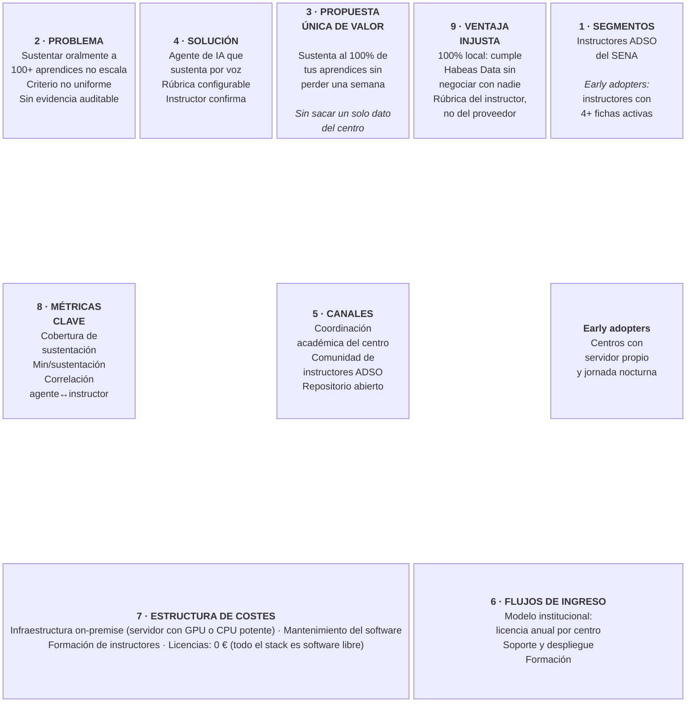

# 03 — Lean Canvas

> Modelo de negocio en una página. EvalAgent SENA · v2.0

---

---

## Detalle por bloque

### 1 · Segmentos de clientes

| Segmento | Descripción | Tamaño estimado |
|---|---|---|
| **Primario** | Instructores del programa ADSO del SENA con 3+ fichas activas | ~1.200 instructores a nivel nacional |
| **Secundario** | Coordinación académica de centros de formación | ~120 centros |
| **Usuario final** | Aprendices ADSO | ~90.000 aprendices activos |
| **Early adopters** | Instructores de jornada nocturna con fichas numerosas y centro con servidor propio | ~80 instructores |

### 2 · Problema

Los tres problemas prioritarios (detalle en [`01-problematica.md`](01-problematica.md)):

1. **Sustentar oralmente a 100+ aprendices por trimestre no cabe en la jornada** (P1).
2. **El criterio de evaluación no es uniforme** entre el primer aprendiz y el último (P2).
3. **No queda evidencia auditable** de qué se preguntó ni qué se respondió (P3).

**Alternativas existentes:** sustentación por muestreo · cuestionario escrito (se responde con IA) ·
videollamada grabada (no ahorra tiempo) · defensa grupal (esconde a los débiles).

### 3 · Propuesta única de valor

> **Sustenta oralmente al 100 % de tus aprendices sin perder una semana —
> y sin que un solo dato personal salga de tu centro.**

*Concepto de alto nivel:* **"Un jurado de sustentación que no se cansa, aplica siempre tu
rúbrica, y siempre te deja la última palabra."**

### 4 · Solución

| Problema | Cómo lo resuelve |
|---|---|
| P1 Tiempo | El agente conduce la sustentación completa; el instructor solo revisa (≤ 3 min) |
| P2 Inconsistencia | Rúbrica explícita definida por el instructor, aplicada igual a todos |
| P3 Sin evidencia | Transcripción íntegra persistida y exportable de cada sesión |
| P4 Copia | Cobertura del 100 % restaura el efecto disuasorio |
| R1 Datos personales | Whisper, Llama y Piper corren en la infraestructura del centro |

### 5 · Canales

- **Directo:** coordinación académica de centros de formación (venta institucional).
- **Comunidad:** grupos de instructores ADSO, semilleros de investigación del SENA.
- **Abierto:** repositorio público — el propio código es el canal de adopción.
- **Prescripción:** instructor que lo usa y lo recomienda al resto de su centro.

### 6 · Flujos de ingreso

| Modelo | Descripción |
|---|---|
| **Licencia institucional** | Cuota anual por centro de formación, escalada por número de aprendices |
| **Despliegue y soporte** | Instalación on-premise, actualizaciones y soporte técnico |
| **Formación** | Taller para instructores: cómo diseñar guías y rúbricas efectivas para el agente |
| **Núcleo abierto** | El motor es abierto; se cobra la operación, el soporte y las funciones de gestión |

> El producto nace en un contexto de entidad pública con presupuesto de licencias ≈ 0.
> El modelo realista a corto plazo es **adopción interna sin coste de licencia**, con
> ingresos por despliegue y formación.

### 7 · Estructura de costes

| Concepto | Naturaleza | Estimación |
|---|---|---|
| Servidor on-premise (CPU potente o GPU media) | CAPEX puntual por centro | ~2.500 € |
| Licencias de software | — | **0 €** (todo libre: FastAPI, Postgres, Whisper, Llama, Piper) |
| APIs de IA de terceros | — | **0 €** (ejecución 100 % local) |
| Desarrollo y mantenimiento | OPEX | 1 persona a tiempo parcial |
| Formación de instructores | OPEX | ~4 h por centro |

### 8 · Métricas clave

Ver definición completa en [`02-prd.md` §9](02-prd.md#9-métricas-de-éxito-kpis).

- **K1** Cobertura de sustentación: ≥ 95 % (línea base ~35 %)
- **K2** Tiempo de instructor por sustentación: ≤ 3 min (línea base 15–20 min)
- **K4** Correlación nota-agente ↔ nota-instructor: ≥ 0,75
- **K8** Fugas de datos entre instituciones: **0**

### 9 · Ventaja competitiva injusta

| Ventaja | Por qué es difícil de copiar |
|---|---|
| **Ejecución 100 % local** | Un SaaS comercial construido sobre OpenAI o Anthropic no puede prometer que los datos no salen. Para una entidad pública colombiana, esto no es un extra: es la condición de entrada. |
| **Rúbrica del instructor** | El criterio de evaluación lo define quien enseñó, no el proveedor. Ningún producto genérico de "IA educativa" puede replicar el criterio de un instructor ADSO concreto. |
| **Conocimiento del dominio SENA** | Fichas, trimestres, guías de aprendizaje, competencias: el modelo de datos habla el idioma de la institución, no el de un LMS genérico. |
| **Coste marginal cero por sustentación** | Sin coste por token, sustentar 100 o 10.000 veces cuesta lo mismo. |
