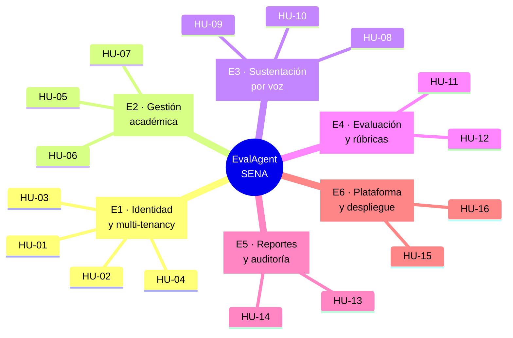
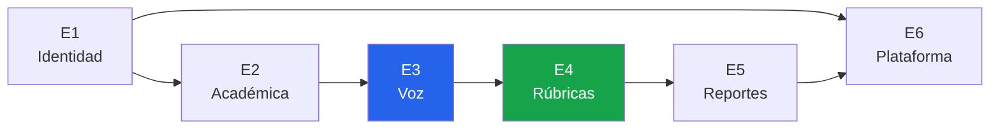

# 01 — Épicas

> Agrupaciones de trabajo de alto nivel. Cada épica se descompone en historias de usuario
> ([`02-historias-usuario.md`](02-historias-usuario.md)) y éstas en tickets
> ([`../03-tickets/`](../03-tickets/)).

---

## Mapa de épicas

---

## E1 — Identidad y multi-tenancy

**Objetivo:** que cada persona entre con su cuenta, vea únicamente lo que le corresponde y
que los datos de una institución jamás sean accesibles desde otra.

| Campo | Valor |
|---|---|
| **Valor de negocio** | Habilitador. Sin esto no existe el SaaS ni el cumplimiento de datos personales. |
| **Problemas que ataca** | Prerrequisito de todos |
| **Historias** | HU-01, HU-02, HU-03, HU-04 |
| **Criterio de cierre** | Un usuario de la institución A recibe `404` en cualquier recurso de la institución B |
| **Riesgo asociado** | RG-7 (alcance) |

---

## E2 — Gestión académica

**Objetivo:** replicar el modelo mental de Google Classroom en el dominio SENA — el
instructor crea fichas, publica guías de aprendizaje con su rúbrica e inscribe aprendices.

| Campo | Valor |
|---|---|
| **Valor de negocio** | Es lo que convierte un script local en una plataforma usable por un centro entero. |
| **Problemas que ataca** | [P1](../01-producto/01-problematica.md#21-descomposición-del-problema) (cuello de botella) |
| **Historias** | HU-05, HU-06, HU-07 |
| **Criterio de cierre** | Un instructor lleva una ficha con 30 aprendices y 2 guías sin tocar el sistema de ficheros |
| **Depende de** | E1 |

---

## E3 — Sustentación por voz

**Objetivo:** que el aprendiz mantenga una conversación técnica hablada con el agente,
anclada a la guía concreta que está sustentando.

| Campo | Valor |
|---|---|
| **Valor de negocio** | Es el corazón del producto: el flujo E2E que crea el valor completo. |
| **Problemas que ataca** | P1, P4 (copia), P6 (agenda) |
| **Historias** | HU-08, HU-09, HU-10 |
| **Criterio de cierre** | Sesión completa de 8 preguntas con transcripción íntegra, en Linux y macOS |
| **Depende de** | E2 |
| **Riesgo asociado** | RG-1 (alucinación), RG-2 (STT), RG-4 (hardware) |

---

## E4 — Evaluación y rúbricas

**Objetivo:** que el criterio de calificación sea explícito, configurable por el instructor
y aplicado de forma uniforme — y que la decisión final la tome siempre un humano.

| Campo | Valor |
|---|---|
| **Valor de negocio** | Resuelve la inconsistencia (P2) y es el requisito ético/legal innegociable. |
| **Problemas que ataca** | P2 (inconsistencia) |
| **Historias** | HU-11, HU-12 |
| **Criterio de cierre** | Ninguna sesión llega a `CALIFICADA` sin confirmación explícita de un instructor |
| **Depende de** | E3 |
| **Riesgo asociado** | RG-5 (sesgo) |

---

## E5 — Reportes y auditoría

**Objetivo:** dejar evidencia consultable y exportable de cada sustentación, y permitir
leer el desempeño agregado de una ficha.

| Campo | Valor |
|---|---|
| **Valor de negocio** | Es lo que permite defender una nota ante una reclamación o una auditoría. |
| **Problemas que ataca** | P3 (sin evidencia), P5 (sin trazabilidad) |
| **Historias** | HU-13, HU-14 |
| **Criterio de cierre** | Cualquier sesión pasada se recupera con transcripción, notas y quién las confirmó |
| **Depende de** | E4 |

---

## E6 — Plataforma y despliegue

**Objetivo:** que el sistema se levante con un comando, tenga tests automatizados en CI y
esté accesible en una URL pública.

| Campo | Valor |
|---|---|
| **Valor de negocio** | Sin despliegue el producto no existe para el usuario final. Requisito de la entrega final. |
| **Problemas que ataca** | R2 (conectividad), R4 (instructor no es sysadmin) |
| **Historias** | HU-15, HU-16 |
| **Criterio de cierre** | `docker compose up` levanta todo; GitHub Actions en verde; URL pública operativa |
| **Depende de** | E1–E5 |

---

## Dependencias entre épicas

**Camino crítico:** E1 → E2 → E3 → E4. Es el flujo E2E prioritario del MVP.
