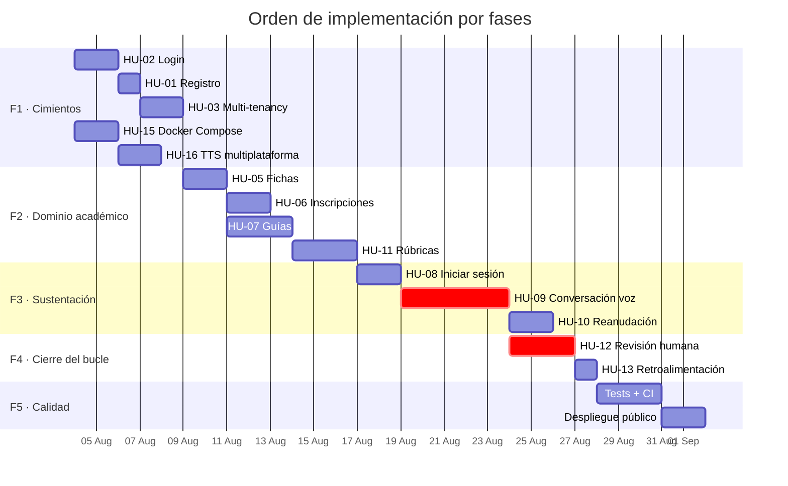

# 03 — Backlog de producto priorizado

> Lista ordenada de todo lo que hay que construir. La priorización genera **un único orden
> de implementación**. Método: **MoSCoW** para la categoría + **WSJF** para el orden dentro
> de cada categoría. *(Módulo 5 — Máster AI4Devs)*

---

## 1. Método de priorización

**WSJF** (*Weighted Shortest Job First*) = `Valor de negocio + Urgencia + Reducción de riesgo` ÷ `Esfuerzo`

Cada factor se puntúa de 1 a 10. A mayor WSJF, antes se implementa.

| Factor | Qué mide en este proyecto |
|---|---|
| **Valor de negocio** | Cuánto acerca al flujo E2E que crea valor completo |
| **Urgencia** | Si bloquea otras historias o una fecha de entrega |
| **Reducción de riesgo** | Si despeja una incertidumbre técnica o legal importante |
| **Esfuerzo** | Puntos de historia (S=3, M=5, L=8, XL=13) |

---

## 2. Backlog ordenado

| # | Historia | MoSCoW | Valor | Urg. | Riesgo | Esf. | **WSJF** | Fase |
|---|---|---|---|---|---|---|---|---|
| 1 | [HU-02](02-historias-usuario.md#hu-02--inicio-de-sesión-con-rol) Login con rol | 🔴 Must | 9 | 10 | 6 | 5 | **5,00** | F1 |
| 2 | [HU-01](02-historias-usuario.md#hu-01--registro-de-instructor) Registro de instructor | 🔴 Must | 8 | 10 | 5 | 5 | **4,60** | F1 |
| 3 | [HU-15](02-historias-usuario.md#hu-15--levantar-el-sistema-con-un-comando) Arranque con un comando | 🔴 Must | 7 | 9 | 7 | 5 | **4,60** | F1 |
| 4 | [HU-16](02-historias-usuario.md#hu-16--voz-del-agente-multiplataforma) TTS multiplataforma | 🔴 Must | 8 | 7 | 9 | 5 | **4,80** | F1 |
| 5 | [HU-05](02-historias-usuario.md#hu-05--crear-y-gestionar-fichas) CRUD de fichas | 🔴 Must | 9 | 9 | 3 | 5 | **4,20** | F2 |
| 6 | [HU-03](02-historias-usuario.md#hu-03--aislamiento-entre-instituciones) Aislamiento multi-tenant | 🔴 Must | 9 | 8 | 10 | 8 | **3,38** | F1 |
| 7 | [HU-07](02-historias-usuario.md#hu-07--publicar-una-guía-de-aprendizaje) Publicar guía | 🔴 Must | 10 | 9 | 5 | 8 | **3,00** | F2 |
| 8 | [HU-11](02-historias-usuario.md#hu-11--definir-la-rúbrica-de-una-guía) Rúbrica configurable | 🔴 Must | 9 | 7 | 7 | 8 | **2,88** | F2 |
| 9 | [HU-08](02-historias-usuario.md#hu-08--iniciar-una-sustentación-desde-la-guía) Iniciar sustentación | 🔴 Must | 9 | 8 | 4 | 8 | **2,63** | F3 |
| 10 | [HU-12](02-historias-usuario.md#hu-12--revisar-y-confirmar-la-calificación) Revisión humana | 🔴 Must | 10 | 7 | 9 | 8 | **3,25** | F4 |
| 11 | [HU-06](02-historias-usuario.md#hu-06--inscribir-aprendices-en-una-ficha) Inscribir aprendices | 🟠 Should | 8 | 7 | 2 | 5 | **3,40** | F2 |
| 12 | [HU-09](02-historias-usuario.md#hu-09--conversar-por-voz-con-el-agente) Conversación por voz | 🔴 Must | 10 | 9 | 8 | 13 | **2,08** | F3 |
| 13 | [HU-13](02-historias-usuario.md#hu-13--consultar-la-retroalimentación) Ver retroalimentación | 🟠 Should | 7 | 5 | 2 | 3 | **4,67** | F4 |
| 14 | [HU-10](02-historias-usuario.md#hu-10--reanudar-una-sesión-interrumpida) Reanudar sesión | 🟠 Should | 6 | 4 | 5 | 5 | **3,00** | F3 |
| 15 | [HU-14](02-historias-usuario.md#hu-14--panel-de-desempeño-por-ficha) Panel de desempeño | 🔵 Could | 6 | 2 | 1 | 5 | **1,80** | Post-MVP |
| 16 | [HU-04](02-historias-usuario.md#hu-04--gestión-de-instituciones-admin) Gestión de instituciones | 🔵 Could | 4 | 3 | 2 | 5 | **1,80** | Post-MVP |

> **Nota sobre HU-09:** tiene el WSJF más bajo de las Must-Have por su esfuerzo XL, pero es
> el corazón del producto y **no puede salir del MVP**. WSJF ordena *dentro* de una
> categoría MoSCoW; no degrada una Must-Have a Should-Have. Su bajo WSJF es la señal de que
> conviene **dividirla** (ver §4).

---

## 3. Orden de implementación

---

## 4. División sugerida de HU-09

HU-09 está estimada en **XL (13 pts)**, lo que incumple el criterio **S (Small)** de INVEST.
Si no cabe en un sprint, se divide así:

| Sub-historia | Alcance | Est. |
|---|---|---|
| **HU-09a** | Canal WebSocket: audio del navegador → transcripción devuelta en pantalla | M (5) |
| **HU-09b** | Motor conversacional: el agente repregunta anclado a la guía | M (5) |
| **HU-09c** | Síntesis de voz de la respuesta y reproducción en el navegador | S (3) |

Cada una es entregable y demostrable por separado.

---

## 5. Deuda técnica en el backlog

Elementos heredados de la v1, documentados en `DOCUMENTACION_TECNICA.md` §14.

| ID | Deuda | Severidad | Tratamiento |
|---|---|---|---|
| **D1** | TTS solo funciona en macOS (`say` en lugar de Piper) | 🔴 Alta | Promovida a historia: **HU-16** |
| **D2** | README dice Whisper `small`, el código usa `medium` | 🟡 Media | Se corrige al reescribir la documentación |
| **D3** | README dice 10 preguntas, el código usa 8 | 🟢 Baja | Deja de ser discrepancia: pasa a ser configurable por guía (HU-07) |
| **D4** | `admin.html` no estaba documentado | 🟢 Baja | Absorbido por el rediseño del frontend |
| **D5** | `requirements.txt` incompleto respecto al fallback de STT | 🟡 Media | Se corrige al fijar dependencias en F1 |
| **D6** | `CORS allow_origins=["*"]` con `allow_credentials=True` | 🔴 Alta | **Nuevo ticket T-013**: lista blanca por entorno |
| **D7** | Estado de sesión solo en memoria (`sessions: dict`) | 🟠 Alta | Resuelto por HU-10 (persistencia del estado del turno) |
| **D8** | Criterios de evaluación hardcodeados (`python`/`api`) | 🟠 Alta | Resuelto por HU-11 (rúbrica configurable) |

---

## 6. Fuera del MVP (parking lot)

Ideas registradas para no perderlas, explícitamente **fuera** de las tres entregas:

- Autoinscripción del aprendiz mediante código de ficha (como Google Classroom).
- Sustentación supervisada con verificación de identidad (mitiga RG-6).
- Notificaciones por correo al publicar una guía o una nota.
- Integración con Sofía Plus / Territorium para volcar notas.
- Modo entrenamiento: el aprendiz practica sin que cuente para nota.
- Detección de respuestas leídas literalmente de un guion.
- Analítica comparativa entre fichas e instructores.
- Aplicación móvil.
