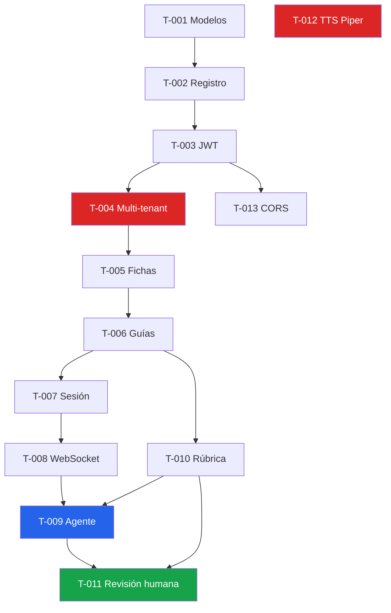

# Tickets de trabajo

Descomposición técnica de las [historias de usuario](../02-backlog/02-historias-usuario.md).
Estructura conforme al Módulo 5 del Máster AI4Devs: título, descripción, alcance técnico,
criterios de aceptación, estimación, dependencias y definición de terminado.

| Ticket | Título | Historia | Tipo | Est. | Estado |
|---|---|---|---|---|---|
| [T-001](T-001-modelo-usuario-institucion.md) | Modelar Institución, Usuario y roles | HU-01 | Técnica | 3 | `Por hacer` |
| [T-002](T-002-endpoint-registro.md) | Endpoint de registro de instructor | HU-01 | Característica | 3 | `Por hacer` |
| [T-003](T-003-jwt-login-refresh.md) | Autenticación JWT access + refresh | HU-02 | Característica | 5 | `Por hacer` |
| [T-004](T-004-aislamiento-multitenant.md) | Aislamiento multi-tenant | HU-03 | Seguridad | 5 | `Por hacer` |
| [T-005](T-005-crud-fichas.md) | CRUD de fichas | HU-05 | Característica | 5 | `Por hacer` |
| [T-006](T-006-crud-guias.md) | Guías de aprendizaje | HU-07 | Característica | 5 | `Por hacer` |
| [T-007](T-007-sesion-sustentacion.md) | Ciclo de vida de la sesión | HU-08 | Característica | 5 | `Por hacer` |
| [T-008](T-008-canal-websocket-voz.md) | Canal WebSocket autenticado | HU-09 | Característica | 5 | `Por hacer` |
| [T-009](T-009-motor-agente-guia.md) | Motor del agente anclado a la guía | HU-09 | Característica | 8 | `Por hacer` |
| [T-010](T-010-rubrica-configurable.md) | Rúbrica configurable por guía | HU-11 | Característica | 5 | `Por hacer` |
| [T-011](T-011-revision-humana.md) | Revisión y confirmación humana | HU-12 | Característica | 5 | `Por hacer` |
| [T-012](T-012-tts-multiplataforma.md) | TTS multiplataforma con Piper | HU-16 | 🐞 Bug (D1) | 5 | `Por hacer` |
| [T-013](T-013-cors-lista-blanca.md) | CORS con lista blanca | — | 🐞 Bug (D6) | 2 | `Por hacer` |

**Total estimado del camino crítico:** 61 puntos de historia.

## Grafo de dependencias

`T-012` no tiene dependencias: se puede abordar en paralelo desde el primer día.
