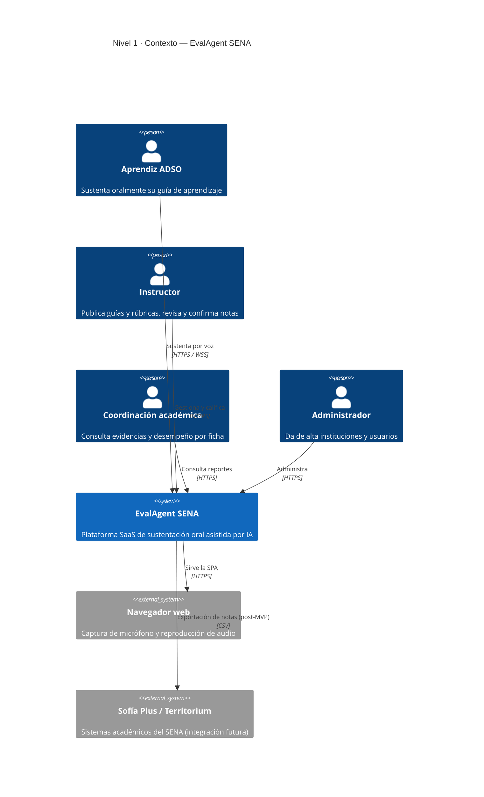
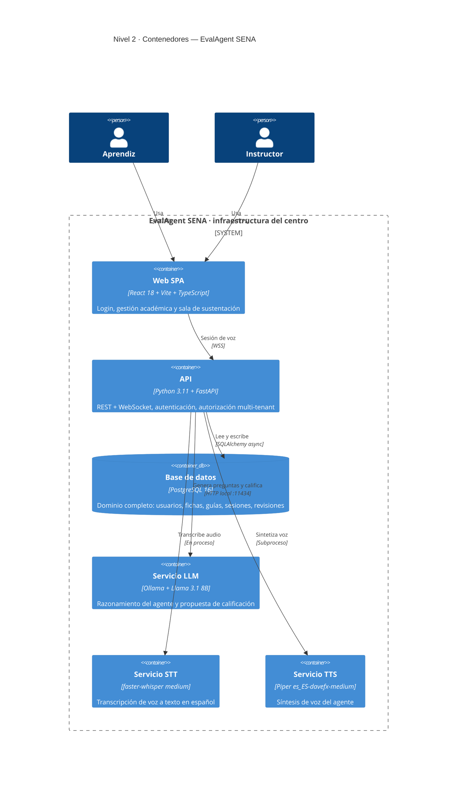
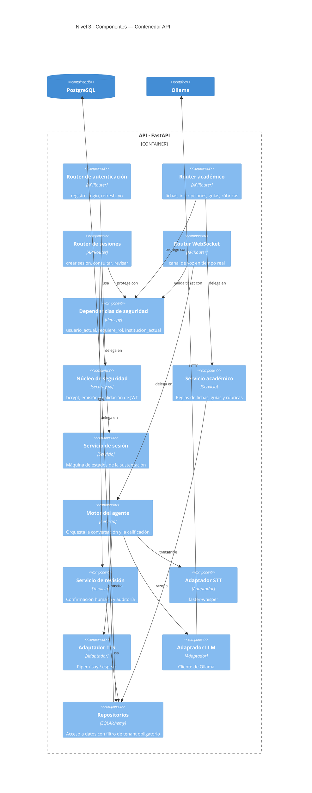
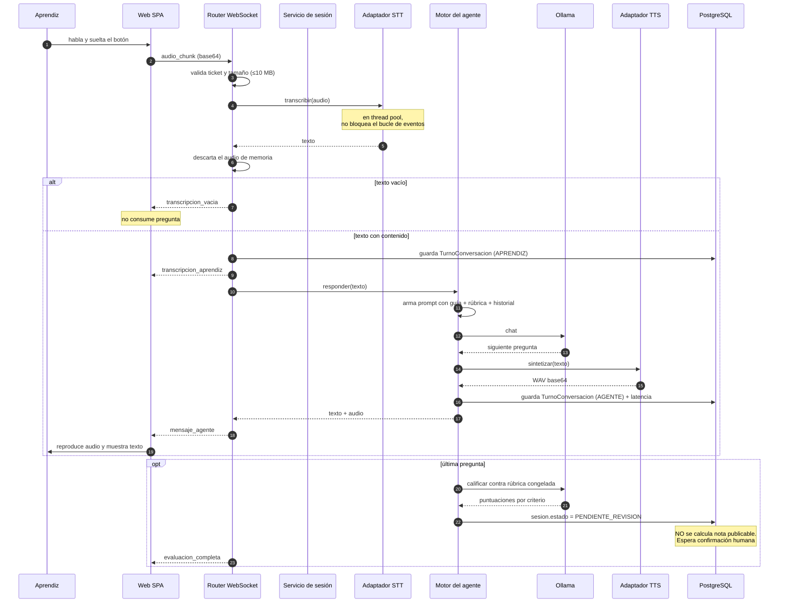
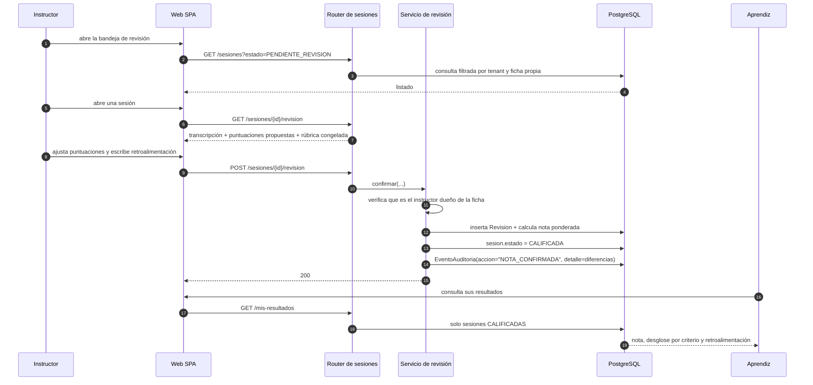
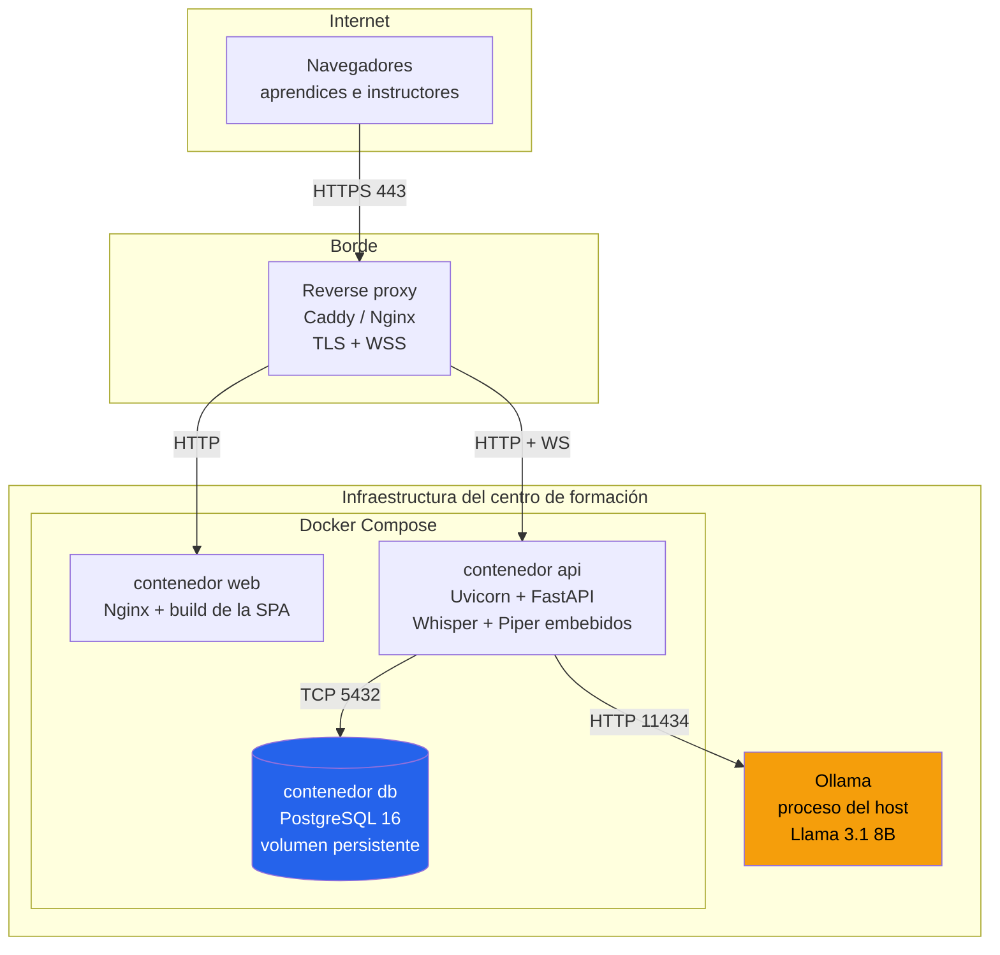

# 01 — Arquitectura del sistema

> EvalAgent SENA v2.0 · Modelo **C4** (Contexto → Contenedores → Componentes → Código)
> Diagramas como código en Mermaid, renderizables en GitHub, GitLab y VS Code.

---

## 1. Principios de arquitectura

| # | Principio | Consecuencia práctica |
|---|---|---|
| **A1** | **La IA corre dentro de la institución** | Whisper, Llama y Piper son procesos locales. Cero llamadas a APIs de terceros. ([ADR-001](adr/ADR-001-ejecucion-local-llm.md)) |
| **A2** | **El tenant vive en el token, no en la petición** | El cliente jamás elige de qué institución lee. ([ADR-003](adr/ADR-003-multitenancy.md)) |
| **A3** | **Ninguna nota se publica sin humano** | La arquitectura no contempla una ruta automática a `CALIFICADA`. ([ADR-006](adr/ADR-006-humano-en-el-bucle.md)) |
| **A4** | **El estado de la sesión es persistente** | Un reinicio del servidor no destruye una sustentación en curso. Corrige la deuda D7. |
| **A5** | **La voz es sustituible** | El TTS es una interfaz con varias implementaciones; nunca una llamada directa a un binario del sistema. ([ADR-005](adr/ADR-005-tts-multiplataforma.md)) |
| **A6** | **Solo texto se persiste** | El audio se procesa en memoria y se descarta. Minimización de datos por diseño. |

---

## 2. Nivel 1 — Contexto del sistema



> **Frontera clave:** no hay ninguna flecha hacia un proveedor externo de IA. Es el
> requisito **R1** del análisis de la problemática y la ventaja competitiva del Lean Canvas.

---

## 3. Nivel 2 — Contenedores



### Comparativa v1 → v2

| Aspecto | v1 | v2 |
|---|---|---|
| Frontend | 2 ficheros HTML sueltos | SPA React con rutas y roles |
| Autenticación | ninguna | JWT con roles y multi-tenancy |
| Persistencia | ficheros `.md` y `.json` | PostgreSQL con migraciones |
| Estado de sesión | `dict` en memoria | tabla `sesion` |
| Criterios de evaluación | hardcodeados (`python`/`api`) | rúbrica por guía definida por el instructor |
| Calificación | propuesta = nota final | propuesta → revisión humana → nota |
| TTS | `say` de macOS | Piper (Linux, macOS, Windows) |
| Despliegue | `start.sh` local | Docker Compose + CI/CD |

---

## 4. Nivel 3 — Componentes de la API



### Estructura de carpetas

```
backend/
├── app/
│   ├── main.py                 # Ensamblado de la aplicación y middleware
│   ├── core/
│   │   ├── config.py           # Configuración por variables de entorno
│   │   ├── security.py         # bcrypt + JWT
│   │   └── logging.py          # Logs estructurados
│   ├── db/
│   │   ├── base.py             # Clase declarativa base
│   │   └── session.py          # Motor y sesión async
│   ├── models/                 # Entidades SQLAlchemy
│   ├── schemas/                # Contratos Pydantic (entrada/salida)
│   ├── repositories/           # Acceso a datos con filtro de tenant
│   ├── services/               # Reglas de negocio
│   │   ├── agente.py           # Motor conversacional
│   │   ├── stt.py · tts.py     # Adaptadores de voz
│   │   └── llm.py              # Cliente de Ollama
│   ├── api/
│   │   ├── deps.py             # Dependencias transversales
│   │   └── v1/                 # Routers versionados
│   └── tests/
├── alembic/                    # Migraciones
└── pyproject.toml
```

---

## 5. Nivel 4 — Flujo de un turno de conversación



---

## 6. Flujo de la revisión humana



---

## 7. Nivel de despliegue



**Por qué Ollama vive en el host y no en un contenedor:** el acceso a GPU desde contenedor
añade complejidad (drivers, `nvidia-container-toolkit`) que un técnico de centro de
formación no tiene por qué resolver. Ollama en el host es un instalador de un clic.

### Requisitos mínimos

| Perfil | CPU | RAM | Modelos | Sesiones simultáneas |
|---|---|---|---|---|
| **Mínimo** | 8 núcleos | 16 GB | Whisper `small` + Llama 3.2 3B | 2–3 |
| **Recomendado** | 12 núcleos | 32 GB | Whisper `medium` + Llama 3.1 8B | 8–10 |
| **Con GPU** | 8 núcleos + 8 GB VRAM | 32 GB | Whisper `medium` + Llama 3.1 8B | 15+ |

> Mitigación del riesgo **RG-4**: el perfil mínimo se activa con variables de entorno,
> sin tocar código.

---

## 8. Decisiones de arquitectura (ADRs)

| ADR | Decisión | Estado |
|---|---|---|
| [ADR-001](adr/ADR-001-ejecucion-local-llm.md) | IA 100 % local, sin APIs externas | Aceptada |
| [ADR-002](adr/ADR-002-postgres-sobre-ficheros.md) | PostgreSQL en lugar de ficheros | Aceptada |
| [ADR-003](adr/ADR-003-multitenancy.md) | Multi-tenancy por columna discriminadora | Aceptada |
| [ADR-004](adr/ADR-004-websocket-vs-webrtc.md) | WebSocket con audio por turnos, no WebRTC continuo | Aceptada |
| [ADR-005](adr/ADR-005-tts-multiplataforma.md) | TTS como interfaz con motores intercambiables | Aceptada |
| [ADR-006](adr/ADR-006-humano-en-el-bucle.md) | Confirmación humana obligatoria de toda nota | Aceptada |
| [ADR-007](adr/ADR-007-rubrica-congelada.md) | La sesión congela una copia de su rúbrica | Aceptada |

---

## 9. Atributos de calidad

| Atributo | Táctica arquitectónica |
|---|---|
| **Privacidad** | Todo el procesamiento de IA dentro del perímetro del centro; el audio nunca se persiste |
| **Seguridad** | JWT con tenant embebido; filtro obligatorio en el repositorio base; ticket de un solo uso para el WebSocket |
| **Disponibilidad** | Estado de sesión persistido: un reinicio no destruye una sustentación en curso |
| **Rendimiento** | STT en *thread pool*; audio como turnos discretos, no flujo continuo |
| **Portabilidad** | TTS como interfaz; todo el sistema en contenedores |
| **Auditabilidad** | Tabla de eventos append-only; rúbrica y propuesta del agente congeladas |
| **Evolutividad** | API versionada (`/api/v1`); servicios desacoplados de los routers |
