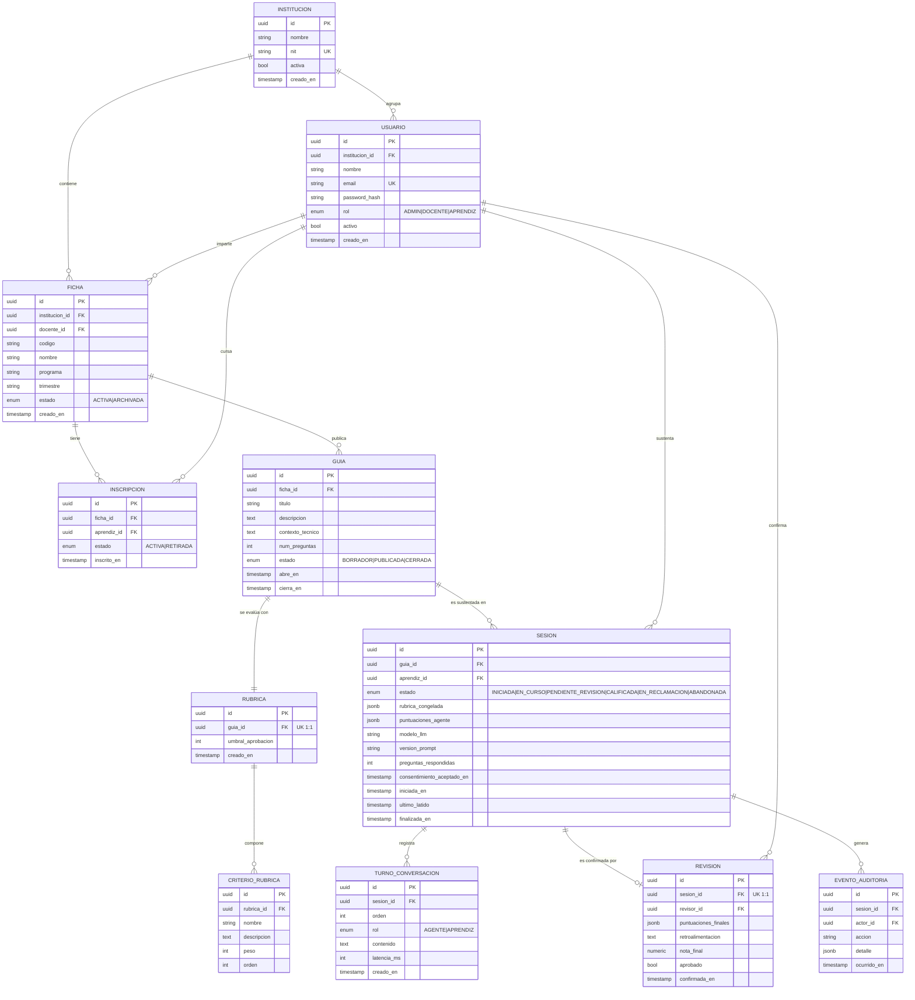
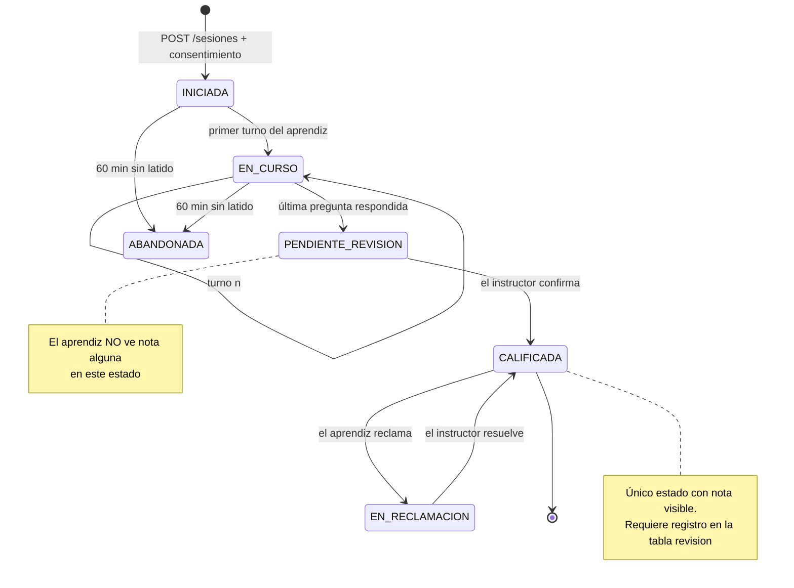

# 02 — Modelo de datos

> PostgreSQL 16 · SQLAlchemy 2.0 (async) · migraciones con Alembic
> Versión `2.0` — sustituye a la persistencia en ficheros de la v1

---

## 1. Diagrama entidad-relación



---

## 2. Diccionario de entidades

### `institucion` — Tenant raíz
Unidad de aislamiento del SaaS. **Todo dato del sistema cuelga, directa o indirectamente,
de una institución.**

| Columna | Tipo | Restricciones | Notas |
|---|---|---|---|
| `id` | UUID | PK | |
| `nombre` | varchar(200) | NOT NULL | Ej. "Centro de Servicios y Gestión Empresarial" |
| `nit` | varchar(20) | UNIQUE NOT NULL | Identificador fiscal del centro |
| `activa` | boolean | NOT NULL, default `true` | Baja lógica |

### `usuario` — Persona con acceso

| Columna | Tipo | Restricciones | Notas |
|---|---|---|---|
| `id` | UUID | PK | |
| `institucion_id` | UUID | FK → `institucion`, NOT NULL, ON DELETE RESTRICT | Discriminador de tenant |
| `email` | citext | UNIQUE NOT NULL | Único **global**, no por tenant: una persona, una cuenta |
| `password_hash` | varchar(255) | NOT NULL | bcrypt, coste 12. Nunca en logs ni en `__repr__` |
| `rol` | enum | NOT NULL | `ADMIN` · `DOCENTE` · `APRENDIZ` |

> **Índice:** `idx_usuario_institucion_rol (institucion_id, rol)` — soporta el listado de
> aprendices de un centro, que es la consulta más frecuente del panel docente.

### `ficha` — Curso/clase (equivalente a una clase de Classroom)

| Columna | Tipo | Restricciones |
|---|---|---|
| `codigo` | varchar(20) | NOT NULL — código oficial SENA, ej. `2758421` |
| `programa` | varchar(120) | NOT NULL — ej. "ADSO" |
| `trimestre` | varchar(10) | NOT NULL — ej. `2026-2` |
| `estado` | enum | `ACTIVA` · `ARCHIVADA` |

> **Restricción:** `UNIQUE (institucion_id, codigo)` — el mismo código puede repetirse en
> centros distintos, pero no dentro del mismo.

### `inscripcion` — Aprendiz ↔ Ficha
Tabla de unión con estado propio. `UNIQUE (ficha_id, aprendiz_id)`.

### `guia` — Guía de aprendizaje
Sustituye a los ficheros `proyectos/*.md` de la v1.

| Columna | Tipo | Notas |
|---|---|---|
| `contexto_tecnico` | text | **Markdown. Es lo que se inyecta en el prompt del agente.** Ancla las preguntas al temario real. |
| `num_preguntas` | int | Default 8, rango válido 3–20 |
| `abre_en` / `cierra_en` | timestamptz | Ventana de sustentación |
| `estado` | enum | `BORRADOR` · `PUBLICADA` · `CERRADA` |

### `rubrica` y `criterio_rubrica` — Criterio de evaluación
Sustituyen al diccionario `SCORING_CRITERIA` hardcodeado de la v1.

- Relación 1:1 con `guia` (`UNIQUE (guia_id)`).
- **Invariante de negocio:** `SUM(criterio_rubrica.peso) = 100` por rúbrica.
  Se valida en la capa de servicio, no en la base de datos, para poder devolver un `422`
  con un mensaje útil.
- `umbral_aprobacion`: entero 0–100, por defecto 60.

### `sesion` — Sustentación
El estado deja de vivir en memoria (deuda **D7** de la v1) y pasa a la base de datos.

| Columna | Notas |
|---|---|
| `rubrica_congelada` | **JSONB. Copia inmutable de la rúbrica en el momento de sustentar.** Si el instructor la edita después, las notas ya emitidas siguen siendo defendibles. |
| `puntuaciones_agente` | JSONB. Propuesta del agente. Se conserva aunque el instructor la modifique — es la evidencia de auditoría. |
| `modelo_llm` / `version_prompt` | Trazabilidad: con qué modelo y qué prompt se evaluó |
| `ultimo_latido` | Soporta la detección de sesiones abandonadas (HU-10) |
| `consentimiento_aceptado_en` | Requisito legal: sin este dato la sesión no se crea |

> **No existe columna de audio.** Solo se persiste la transcripción textual (RNF-09).

### `turno_conversacion` — Transcripción
Un registro por intervención. `UNIQUE (sesion_id, orden)` garantiza el orden.
`latencia_ms` alimenta el KPI de RNF-01.

### `revision` — Confirmación humana
Relación 1:1 con `sesion`. **Su existencia es lo que distingue una nota publicada de una
propuesta.** Sin registro en esta tabla, el aprendiz no ve ninguna calificación.

### `evento_auditoria` — Rastro inmutable
Append-only. Registra: inicio de sesión de sustentación, cierre, confirmación de nota,
modificación de puntuaciones respecto a la propuesta, reclamación e intentos de acceso
cruzado entre instituciones.

---

## 3. Máquina de estados de la sesión



---

## 4. Reglas de integridad

| # | Regla | Dónde se aplica |
|---|---|---|
| **RI-1** | Los pesos de los criterios de una rúbrica suman 100 | Servicio (`422`) |
| **RI-2** | Una guía no se publica sin rúbrica ni sin `contexto_tecnico` | Servicio (`422`) |
| **RI-3** | Solo se sustenta con inscripción `ACTIVA` en la ficha de la guía | Servicio (`403`) |
| **RI-4** | Una sesión no llega a `CALIFICADA` sin fila en `revision` | Servicio + test exhaustivo |
| **RI-5** | Toda consulta de dominio filtra por `institucion_id` del token | Repositorio base |
| **RI-6** | `cierra_en > abre_en` | Check en BD + servicio |
| **RI-7** | Un aprendiz tiene como máximo una sesión no abandonada por guía | Índice parcial único |
| **RI-8** | `evento_auditoria` no admite `UPDATE` ni `DELETE` | Permisos de BD |

```sql
-- RI-7: índice parcial único
CREATE UNIQUE INDEX idx_sesion_unica_por_guia
    ON sesion (guia_id, aprendiz_id)
    WHERE estado <> 'ABANDONADA';
```

---

## 5. Estrategia de índices

| Índice | Consulta que soporta |
|---|---|
| `idx_usuario_institucion_rol` | Listado de aprendices de un centro |
| `idx_ficha_docente_estado` | Panel del instructor: mis fichas activas |
| `idx_inscripcion_aprendiz` | Panel del aprendiz: mis fichas |
| `idx_guia_ficha_estado` | Guías publicadas de una ficha |
| `idx_sesion_guia_estado` | Bandeja de revisión: sesiones pendientes |
| `idx_turno_sesion_orden` | Reconstrucción de la transcripción |
| `idx_auditoria_sesion_fecha` | Consulta de auditoría por sesión |

---

## 6. Migración desde la v1

| Origen (v1) | Destino (v2) | Estrategia |
|---|---|---|
| `proyectos/*.md` | `guia.contexto_tecnico` | Script de importación: un fichero → una guía en `BORRADOR` |
| `reportes/*.json` → `student_name` | `usuario` (rol `APRENDIZ`) | Alta manual: el nombre suelto no permite identificar al aprendiz de forma fiable |
| `reportes/*.json` → `conversation[]` | `turno_conversacion` | Script de importación conservando el orden |
| `reportes/*.json` → `scores` | `sesion.puntuaciones_agente` | Importación directa; estado resultante `PENDIENTE_REVISION` |
| `SCORING_CRITERIA["api"]` | Plantilla de rúbrica "API REST" | Seed |
| `SCORING_CRITERIA["python"]` | Plantilla de rúbrica "Fundamentos de Python" | Seed |
| `sessions: dict` en memoria | `sesion` en Postgres | No migrable: es estado volátil (deuda D7) |

> Los reportes históricos se importan como `PENDIENTE_REVISION`, nunca como `CALIFICADA`:
> nadie confirmó esas notas, y publicarlas violaría la regla **RI-4**.

---

## 7. Retención y protección de datos

| Dato | Retención | Base legal / justificación |
|---|---|---|
| Audio crudo del aprendiz | **No se almacena** — se procesa en memoria y se descarta | Minimización de datos |
| Transcripción textual | Trimestre en curso + 2 años | Evidencia evaluativa, plazo de reclamación |
| Puntuaciones y revisiones | 5 años | Requisito de auditoría académica |
| Eventos de auditoría | 5 años | Trazabilidad |
| Cuenta de usuario | Hasta baja solicitada | Derecho de supresión (Ley 1581/2012) |

**Anonimización:** al ejercerse el derecho de supresión, el usuario se anonimiza en lugar
de borrarse, para no romper la integridad de los reportes académicos ya emitidos.
