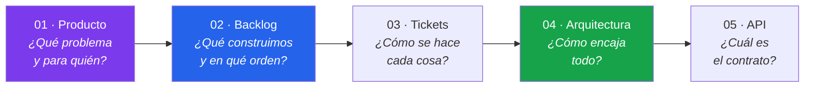

# Documentación · EvalAgent SENA

> Documentación del proyecto final del **Máster AI4Devs** (LIDR Academy), estructurada según
> los lineamientos de los Módulos 4 y 5: del problema al PRD, del PRD al backlog, del
> backlog a los tickets.

---

## Cómo leer esta documentación

El orden de los directorios es el orden de lectura. Cada nivel responde a una pregunta:



---

## Índice

### 01 · Producto — *el porqué*

| Documento | Contenido |
|---|---|
| [01 · Problemática](01-producto/01-problematica.md) | Análisis del problema, dolores por rol, non-goals y restricciones |
| [02 · PRD](01-producto/02-prd.md) | Requisitos de producto: objetivos, stakeholders, funcionalidades, KPIs, riesgos y fases |
| [03 · Lean Canvas](01-producto/03-lean-canvas.md) | Modelo de negocio en una página |

### 02 · Backlog — *el qué y en qué orden*

| Documento | Contenido |
|---|---|
| [01 · Épicas](02-backlog/01-epicas.md) | 6 épicas con su valor, criterio de cierre y dependencias |
| [02 · Historias de usuario](02-backlog/02-historias-usuario.md) | 16 historias con Gherkin y evaluación INVEST |
| [03 · Backlog priorizado](02-backlog/03-backlog-priorizado.md) | Orden de implementación por MoSCoW + WSJF, deuda técnica y parking lot |

### 03 · Tickets — *el cómo*

| Documento | Contenido |
|---|---|
| [Índice de tickets](03-tickets/README.md) | 13 tickets con alcance técnico, criterios de aceptación y grafo de dependencias |

### 04 · Arquitectura — *el encaje*

| Documento | Contenido |
|---|---|
| [01 · Arquitectura](04-arquitectura/01-arquitectura.md) | Modelo C4 completo, despliegue y atributos de calidad |
| [02 · Modelo de datos](04-arquitectura/02-modelo-datos.md) | ERD, diccionario de entidades, reglas de integridad y migración desde la v1 |
| [ADRs](04-arquitectura/adr/README.md) | 7 decisiones de arquitectura con sus alternativas descartadas |

### 05 · API — *el contrato*

| Documento | Contenido |
|---|---|
| [01 · Especificación de la API](05-api/01-especificacion-api.md) | REST + WebSocket, matriz de autorización, formatos de error |

### Raíz del repositorio

| Documento | Contenido |
|---|---|
| [`../prompts.md`](../prompts.md) | Registro de prompts clave, comparativas antes/después y errores de la IA |
| [`../README.md`](../README.md) | Ficha del proyecto, instalación y uso |
| [`../DOCUMENTACION_TECNICA.md`](../DOCUMENTACION_TECNICA.md) | Documentación técnica de la v1 (histórica) |

---

## Trazabilidad

Todo elemento de esta documentación es rastreable de punta a punta:

```
Problema (P1..P6)
   └─> Épica (E1..E6)
         └─> Historia de usuario (HU-01..HU-16)
               └─> Ticket (T-001..T-013)
                     └─> Criterio de aceptación verificable
                           └─> Test automatizado
```

Las tablas de trazabilidad están al final de
[`01-problematica.md`](01-producto/01-problematica.md#trazabilidad) y de
[`02-historias-usuario.md`](02-backlog/02-historias-usuario.md#trazabilidad-historias--problemas--kpis).

---

## Estado de la documentación

| Documento | Estado | Versión |
|---|---|---|
| Problemática | ✅ Completo | 2.0 |
| PRD | ✅ Completo | 2.0 |
| Lean Canvas | ✅ Completo | 2.0 |
| Épicas | ✅ Completo | 2.0 |
| Historias de usuario | ✅ Completo | 2.0 |
| Backlog priorizado | ✅ Completo | 2.0 |
| Tickets | ✅ Completo | 2.0 |
| Arquitectura (C4) | ✅ Completo | 2.0 |
| Modelo de datos | ✅ Completo | 2.0 |
| ADRs | ✅ 7 aceptados | 2.0 |
| Especificación de API | ✅ Completo | 2.0 |
| Registro de prompts | ✅ Completo | 2.0 |

> **Nota sobre la v2.0:** esta documentación describe el rediseño a plataforma SaaS
> multi-tenant. El sistema **implementado** hoy corresponde a la v1 (monousuario, sin
> autenticación, persistencia en ficheros), descrito en
> [`DOCUMENTACION_TECNICA.md`](../DOCUMENTACION_TECNICA.md). La implementación de la v2 se
> ejecuta por las fases F1–F6 del [PRD §12](01-producto/02-prd.md#12-planificación-por-fases).
